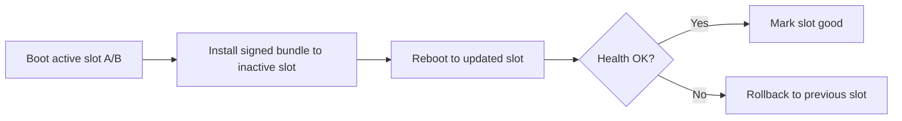
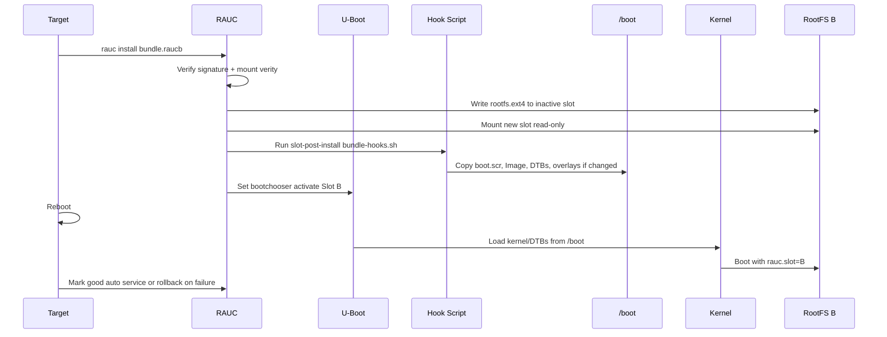

<div align="center">

# 🔄 RAUC Over-The-Air Updates

**Complete guide to A/B system updates with automatic rollback**

[](https://rauc.io/)
[](https://www.kernel.org/doc/html/latest/admin-guide/device-mapper/verity.html)
[](https://www.denx.de/wiki/U-Boot)

</div>

---

## 📖 Overview

This guide covers the complete OTA update workflow using RAUC on Raspberry Pi 5, including:
- 🔀 **A/B Rootfs Updates** — Dual-partition failsafe system
- 🥾 **Boot Asset Updates** — Kernel, DTBs, and U-Boot via bundle hooks
- 🔙 **Automatic Rollback** — Boot failure protection
- 🔐 **Signed Bundles** — Cryptographic verification with dm-verity

### Update Flow



### System Architecture

| Component | Type | Purpose |
|-----------|------|---------|
| **Root Filesystem** | A/B (dual ext4) | Only one active at boot |
| **/boot Partition** | Shared FAT | Firmware, U-Boot, kernel, DTBs |
| **Bundle Format** | dm-verity | Signed, integrity-protected |

---

## 📦 Bundle Contents

RAUC bundles contain everything needed for a complete system update:

| File | Description |
|------|-------------|
| `*.rootfs.ext4` | 🗂️ Root filesystem image for inactive slot |
| `bootfiles.tar.gz` | 🥾 Boot assets (kernel, DTBs, U-Boot) |
| `bundle-hooks.sh` | 🪝 Post-install hook script |

### Boot Files Archive

The `bootfiles.tar.gz` includes:
- `boot.scr` — U-Boot boot script
- `u-boot.bin` — U-Boot bootloader
- `Image` — Linux kernel
- `kernel_2712.img` — Raspberry Pi 5 kernel
- `bcm2712-rpi-5-b.dtb` — Device Tree Blob
- `overlays/` — Device Tree overlays
- `splash.bmp` — Boot splash screen (optional)

---

## 🔄 Installation Sequence



### Key Properties

✅ **Synchronized Updates** — Kernel/DTBs in `/boot` always match modules in rootfs
✅ **Atomic Installation** — Hook runs after rootfs write, before reboot
✅ **Read-only Verification** — New slot mounted read-only during update

---

## 🔙 Rollback Behavior

RAUC's bootchooser provides automatic failsafe:

| Scenario | Behavior |
|----------|----------|
| **Boot Success** | New slot marked good, becomes default |
| **Boot Failure** | Automatic rollback after 3 tries |
| **Health Check Fail** | Manual or auto rollback via `rauc status` |

### Important Considerations

> ⚠️ **Shared /boot Partition**: Kernel/DTBs copied by the hook remain after rollback

**Design Implications:**
- Keep kernel ABI compatible across releases
- Test kernel updates thoroughly before deployment
- Advanced option: Stage bootfiles in rootfs, copy only after marking good

### Rollback Commands

```bash
# Mark current slot as bad (triggers rollback on next boot)
rauc mark-bad booted
reboot

# Or mark the other slot as active
rauc mark-active other
reboot
```

---

## 🛠️ Building Bundles

### Bundle Types

| Bundle Type | Target | Updates | Output File |
|-------------|--------|---------|-------------|
| **Rootfs Only** | Faster updates | Rootfs only | `iot-gw-bundle.raucb` |
| **Full System** | Complete update | Rootfs + Kernel + DTBs | `iot-gw-bundle-full.raucb` |

#### Build Commands

<table>
<tr><th>Rootfs Only</th><th>Rootfs + Kernel</th></tr>
<tr>
<td>

```bash
# Development
make bundle-dev

# Standard
make bundle

# Production
make bundle-prod
```

</td>
<td>

```bash
# Development
make bundle-dev-full

# Standard
make bundle-full

# Production
make bundle-prod-full
```

</td>
</tr>
</table>

> 💡 **Note**: Bundle filename is based on the recipe name, not the image variant. Makefile handles variant selection via `BUNDLE_IMAGE_NAME`.

---

## ✅ Verification & Deployment

### 1. Verify Bundle (Optional)

```bash
# Verify signature and contents
oe-run-native rauc-native rauc info \
  --keyring meta-iot-gateway/recipes-ota/rauc/files/dev-cert.pem \
  build/tmp/deploy/images/raspberrypi5/iot-gw-bundle-full.raucb
```

### 2. Deploy to Device

```bash
# Copy bundle to target
scp build/tmp/deploy/images/raspberrypi5/iot-gw-bundle-full.raucb \
  root@device:/tmp/

# Install and reboot
ssh root@device 'rauc install /tmp/iot-gw-bundle-full.raucb && reboot'
```

### 3. Verify Update

```bash
# Check RAUC status
rauc status --detailed

# Verify kernel version
uname -r

# Check modules are available
ls /lib/modules/$(uname -r)

# Review installation logs
journalctl -u rauc -b | grep "\[bundle-hook\]"
```

---

## 📁 Implementation Files

| Component | Path |
|-----------|------|
| **Bundle Recipes** | `meta-iot-gateway/recipes-ota/bundles/*.bb` |
| **Common Config** | `meta-iot-gateway/recipes-ota/bundles/iot-gw-bundle-common.inc` |
| **Hook Script** | `meta-iot-gateway/recipes-ota/rauc/files/bundle-hooks.sh` |
| **Bootfiles Archive** | `meta-iot-gateway/recipes-bsp/bootimage/rpi-bootfiles-archive.bb` |
| **RAUC Config** | `meta-iot-gateway/recipes-ota/rauc/rauc-conf.bb` |

---

## 🔐 Security

| Feature | Implementation |
|---------|----------------|
| **Bundle Signing** | Cryptographic signatures verified on-device |
| **Integrity Protection** | dm-verity format for tamper detection |
| **Secure Boot** | U-Boot + signed bundles |
| **Keyring** | Device keyring at `/etc/rauc/ca.cert.pem` |

---

## ⚠️ Limitations & Considerations

### Current Design

| Aspect | Behavior |
|--------|----------|
| **/boot Partition** | ❌ Not A/B — updates applied in-place |
| **Kernel Updates** | Applied immediately via hook |
| **Rollback** | Rootfs rolls back, kernel/DTBs remain |

### Recommendations

- ✅ Maintain kernel ABI compatibility between releases
- ✅ Test kernel updates in development environment
- ⚠️ For fully failsafe boot: Consider GPT/MBR boot slot switching

### Advanced Option (Future)

Stage bootfiles in rootfs → Copy to `/boot` only after successful boot + health check → Fully transactional kernel updates

---

## 🔧 Troubleshooting

| Issue | Cause | Solution |
|-------|-------|----------|
| **Modules not loading** | `/boot` files outdated | Verify `uname -r` matches `/lib/modules/` |
| **Hook didn't run** | Bundle missing bootfiles | Check `journalctl -u rauc -b \| grep "[bundle-hook]"` |
| **Signature errors** | Keyring mismatch | Verify device keyring matches build cert |
| **Boot loop** | Incompatible kernel | Automatic rollback after 3 tries |
| **Slot not switching** | Bootchooser issue | Check `fw_printenv BOOT_ORDER` |

### Debug Commands

```bash
# Check current slot and status
rauc status
rauc status --detailed

# View boot environment
fw_printenv | grep BOOT

# Review update logs
journalctl -u rauc --no-pager

# Slot management commands
rauc mark-good booted          # Mark current slot as good
rauc mark-bad booted            # Mark current slot as bad
rauc mark-active other          # Activate the other slot

# Force rollback
rauc mark-bad booted && reboot
```

---

## 📚 References

- [RAUC Documentation](https://rauc.readthedocs.io/)
- [U-Boot Bootchooser](https://rauc.readthedocs.io/en/latest/integration.html#u-boot)
- [dm-verity](https://www.kernel.org/doc/html/latest/admin-guide/device-mapper/verity.html)
