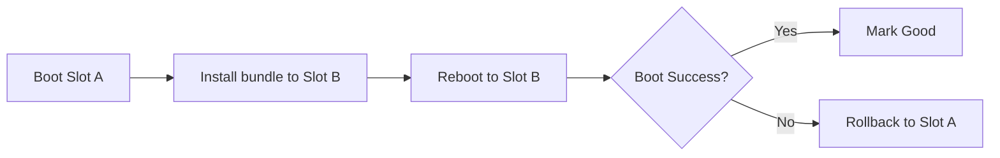

<div align="center">

#  IoT Gateway OS for Raspberry Pi 5

**A production-ready Yocto-based Linux distribution for IoT gateway applications**

[](LICENSE)
[](https://www.yoctoproject.org/)
[](https://www.raspberrypi.com/products/raspberry-pi-5/)
[](https://rauc.io/)

</div>

---

## 📋 Overview

This project delivers a **hardened, embedded Linux distribution** tailored for IoT gateway deployments on Raspberry Pi 5. Built on the Yocto Project with KAS tooling, it offers:

- 🎯 **Custom `iotgw` Distribution** — Optimized for IoT workloads with minimal attack surface
- 🔄 **A/B OTA Updates** — Atomic updates with automatic rollback via RAUC
- 📦 **Container Runtime** — Podman, Buildah, and Skopeo for containerized workloads
- 🛠️ **Developer-Friendly** — Comprehensive tooling for debugging and development
- ⚡ **Fast Builds** — Shared download and sstate caches for reproducible builds

---

## ⚙️ Prerequisites

### Install KAS Build Tool

```bash
pip3 install kas
```

### Layer Management Strategy

Choose your approach based on your use case:

| Approach | When to Use | Configuration |
|----------|------------|---------------|
| **🌐 Auto-Fetch** (Recommended) | Single project, first-time users | `kas/rpi5-autofetch.yml` |
| **💾 Local Clones** (Advanced) | Multi-project reuse, CI/CD pipelines | `~/yocto_resource/layers/` + `rpi5.yml` |

**Auto-fetch** automatically downloads and pins all upstream layers.
**Local clones** reduce network traffic and enable cross-project sstate sharing.

---

## 🚀 Quick Start

### Build Images

<table>
<tr><th>Using KAS Directly</th><th>Using Makefile</th></tr>
<tr>
<td>

```bash
# Base image (headless)
kas build kas/rpi5-autofetch.yml

# Development image
kas shell -c "bitbake iot-gw-image-dev" \
  kas/rpi5-autofetch.yml

# Production image
kas shell -c "bitbake iot-gw-image-prod" \
  kas/rpi5-autofetch.yml

# RAUC bundle
kas shell -c 'bitbake iot-gw-bundle' \
  kas/rauc.yml
```

</td>
<td>

```bash
# Show all targets
make help

# Build images
make base
make dev-rauc
make prod-rauc
make desktop-dev-rauc

# Build bundles
make bundle
make bundle-dev
make bundle-prod
```

</td>
</tr>
</table>

> 💡 **Tip**: Enable RAUC on dev/prod images by setting `IOTGW_ENABLE_RAUC = "1"` in a KAS overlay.


### Flash to SD Card

```bash
# Base image
sudo bmaptool copy \
  build/tmp/deploy/images/raspberrypi5/iot-gw-image-raspberrypi5.rootfs.wic.bz2 \
  /dev/sdX

# Development image
sudo bmaptool copy \
  build/tmp/deploy/images/raspberrypi5/iot-gw-image-dev-raspberrypi5.rootfs.wic.bz2 \
  /dev/sdX

# Production image
sudo bmaptool copy \
  build/tmp/deploy/images/raspberrypi5/iot-gw-image-prod-raspberrypi5.rootfs.wic.bz2 \
  /dev/sdX
```

### Default Credentials

| User | Username | Password |
|------|----------|----------|
| Root | `root` | `iotgateway` |
| Developer | `devel` | `devel` |

> ⚠️ **Security Warning**: Change default passwords immediately after first boot!

---

## 📁 Project Structure

```
rpi5-kas-project/
├── 📄 rpi5.yml                   # Base image configuration
├── 📁 kas/                       # KAS overlays
│   ├── rauc.yml                  # RAUC OTA configuration
│   ├── desktop.yml.example       # Desktop/GUI variant
│   └── local.yml.example         # Local overrides (secrets, WiFi)
├── 📁 meta-iot-gateway/          # Custom Yocto layer
│   ├── conf/distro/              # iotgw distribution config
│   ├── recipes-core/             # Images, packagegroups, base-files
│   ├── recipes-bsp/              # Boot components (U-Boot, splash)
│   ├── recipes-network/          # NetworkManager profiles
│   ├── recipes-support/          # System configs (users, sysctl, journald)
│   ├── recipes-ota/              # RAUC configs and bundles
│   └── wic/                      # Disk partition layouts
├── 📁 build/                     # Build artifacts (generated)
└── 📄 Makefile                   # Convenience targets
```

### External Resources

- **Layers**: `~/yocto_resource/layers/` (optional, for local clones)
- **Downloads**: `~/yocto_resource/DL_SHARED/` (shared package cache)
- **Sstate**: `~/yocto_resource/SSTATE/` (shared build cache)

---

## 💿 Partition Layout (RAUC Image)

### Available Card Sizes

| Card Size | WKS File | Image Size |
|-----------|----------|------------|
| **16GB** (default) | `iot-gw-rauc-16g.wks.in` | ~10GB |
| **32GB** | `iot-gw-rauc-32g.wks.in` | ~20GB |
| **64GB** | `iot-gw-rauc-64g.wks.in` | ~40GB |

Select variant by setting `WKS_FILE` in your KAS overlay:

```yaml
local_conf_header:
  rauc_toggle: |
    WKS_FILE = "iot-gw-rauc-32g.wks.in"  # or -16g / -64g
```

### Default 16GB Layout

| # | Device | Label | Size | Type | Mount | Purpose |
|---|--------|-------|------|------|-------|---------|
| 1 | `/dev/mmcblk0p1` | `boot` | 256M | vfat | `/boot` | 🥾 Bootloader & kernel (shared) |
| 2 | `/dev/mmcblk0p2` | `rootA` | 3G | ext4 | `/` | 🅰️ Root filesystem Slot A |
| 3 | `/dev/mmcblk0p3` | `rootB` | 3G | ext4 | - | 🅱️ Root filesystem Slot B |
| 4 | `/dev/mmcblk0p4` | `data` | 2G | ext4 | `/data` | 💾 Persistent data |

> 📊 **Space Efficiency**: ~10GB total leaves room for wear leveling on 16GB cards

---

## 🔄 RAUC Over-The-Air Updates

### How It Works



1. **Boot** from active slot (A or B)
2. **Install** bundle to the inactive slot
3. **Reboot** into the updated slot
4. **Verify** — Automatic or manual health check
5. **Rollback** on failure (automatic)

### Deploy an Update

```bash
# 1. Copy bundle to device (choose based on what you built)
# Rootfs + kernel update (full):
scp build/tmp/deploy/images/raspberrypi5/iot-gw-bundle-full.raucb \
    root@<device-ip>:/tmp/

# OR rootfs-only update:
scp build/tmp/deploy/images/raspberrypi5/iot-gw-bundle.raucb \
    root@<device-ip>:/tmp/

# 2. Install on device
rauc info /tmp/iot-gw-bundle-full.raucb
rauc install /tmp/iot-gw-bundle-full.raucb
reboot

# 3. Verify after reboot
rauc status
```

### Good Marking

| Method | Command |
|--------|---------|
| **Automatic** | `rauc-mark-good.service` (oneshot after boot) |
| **Manual** | `systemctl start rauc-mark-good && rauc status` |

> 🛡️ **Safety**: Automatic rollback occurs if boot fails or health checks don't pass

### Optional: Serial Logging

```bash
tio -b 115200 -t --log --log-strip --log-directory ./logs /dev/ttyACM0
```

### Boot Flow Notes
- U-Boot prints RAUC bootchooser details during boot:
  - Env: `BOOT_ORDER`, `BOOT_A_LEFT`, `BOOT_B_LEFT`
  - Slot selection and remaining tries
  - Appended kernel args: `root=… rauc.slot=…`
- Optional runtime kernel args:
  - Set: `fw_setenv EXTRA_KERNEL_ARGS "cma=256M"`
  - Clear: `fw_setenv EXTRA_KERNEL_ARGS`
  - U-Boot appends `EXTRA_KERNEL_ARGS` to the kernel cmdline and logs it.

### Bundles Update /boot
- RAUC bundles now carry `bootfiles.tar.gz` and run a post-install hook that refreshes `/boot` if needed:
  - Files considered: `boot.scr`, `u-boot.bin`, `Image`, `kernel_2712.img`, `bcm2712-rpi-5-b.dtb`, `overlays/`, `splash.bmp`
  - Logs: `journalctl -u rauc` shows `[bundle-hook] …` messages
- This keeps kernel/DTBs in sync with the modules in the new rootfs — kernel updates via bundle no longer require re-flashing.

See OTA_UPDATE.md for details, diagrams, and rollback notes.

### 🔐 Security & Signing

> ⚠️ **Critical**: Private keys are NOT included in this repository for security!

#### Generate Your RAUC Keys

First-time setup - generate signing keys:

```bash
./meta-iot-gateway/scripts/generate-rauc-certs.sh
```

This creates keys in the current directory. Move them to a secure location:

```bash
mkdir -p ~/rauc-keys
mv dev-key.pem dev-cert.pem ~/rauc-keys/
```

#### Configure Build System

Create `kas/local.yml` (git-ignored) with your key paths:

```yaml
header:
  version: 18
  includes:
    - "kas/rauc.yml"

local_conf_header:
  rauc_keys: |
    RAUC_KEY_FILE = "${HOME}/rauc-keys/dev-key.pem"
    RAUC_CERT_FILE = "${HOME}/rauc-keys/dev-cert.pem"
```

#### Build Signed Bundles

```bash
# Build bundle with your keys
kas build kas/local.yml --target iot-gw-bundle

# Or build image + bundle
kas build kas/local.yml --target iot-gw-image-prod
```

> 📖 See `meta-iot-gateway/recipes-ota/rauc/files/README-KEYS.md` for detailed key management instructions.

---

## 🎨 Customization

### Package Groups

| Package Group | Contents |
|---------------|----------|
| `packagegroup-iot-gw-base` | 🔧 Core system (systemd, networking, utilities) |
| `packagegroup-iot-gw-apps` | 🚀 Applications (MQTT, containers, runtime) |
| `packagegroup-iot-gw-devtools` | 🐛 Debug tools (vim, tcpdump, strace, gdb) |

### First-boot provisioning (optional)

Place files on `/boot` (FAT) before first boot:
- `/boot/iotgw/authorized_keys`
- `/boot/iotgw/nm/*.nmconnection`
- `/boot/iotgw/nm-conf/*.conf` (e.g., backend override)

### Networking defaults
- NetworkManager backend: `wpa_supplicant`
- Wi‑Fi: no SSIDs stored in the repo. Inject at build time (KAS/local.conf):
  - Single network (legacy):
    ```yaml
    local_conf_header:
      wifi: |
        IOTGW_WIFI_SSID = "HomeWiFi"
        IOTGW_WIFI_PSK = "Secret"
    ```
  - Multiple networks (preferred), one per line as `ssid|psk|iface|method|priority|ipv4addr/prefix|gateway|dns1;dns2`:
    ```yaml
    local_conf_header:
      wifi: |
        IOTGW_WIFI_NETWORKS = "HomeWiFi|Secret|wlan0|manual|100|192.168.0.222/24|192.168.0.1|1.1.1.1;8.8.8.8\nNEWWIFISSID|AnotherPass|wlan0|manual|100|192.168.28.50/24|192.168.28.1|1.1.1.1;8.8.8.8"
    ```
  - Or drop `.nmconnection` files on `/boot/iotgw/nm/` before first boot.
- Bridge `br0`: 192.168.100.1/24, `ipv4.never-default=true`
- Wi‑Fi autoconnect-priority: 100
- MAC randomization (defaults, override in local.conf):
  - `IOTGW_NM_SCAN_RAND = "yes"` (scan-time)
  - `IOTGW_NM_WIFI_CLONED_MAC = "stable"` (per-connection policy: preserve|random|stable)

### Kernel Configuration
- Modular kernel config fragments are provided and can be toggled per build using `IOTGW_KERNEL_FEATURES`.
- Always included:
  - `branding.cfg`: sets `CONFIG_LOCALVERSION="-v8-16k-igw"`.
  - `storage-filesystems.cfg`: enables `overlayfs`, `dm-verity`, and `squashfs(+zstd/xz/zlib)`.
- Optional sets (enable by adding the keyword to `IOTGW_KERNEL_FEATURES`):
  - `igw_compute_media`: VC4/V3D KMS, V4L2/media core, UVC, huge/THP.
  - `igw_containers`: namespaces + cgroups (MEMCG, CGROUP_BPF, etc.).
  - `igw_networking_iot`: WireGuard, SocketCAN(+MCP251x), VLAN 802.1Q.
  - `igw_observability_dev`: BPF/JIT, kprobes, ftrace, kallsyms (dev only).
  - `igw_security_prod`: module signing and AppArmor defaults (prod).

Enable via KAS overlay (example):
```yaml
local_conf_header:
  kernel_features: |
    # Development-focused set
    IOTGW_KERNEL_FEATURES = "igw_compute_media igw_containers igw_networking_iot igw_observability_dev"
```

Production-oriented set:
```yaml
local_conf_header:
  kernel_features: |
    IOTGW_KERNEL_FEATURES = "igw_compute_media igw_containers igw_networking_iot igw_security_prod"
```

Notes
- Headless devices typically don’t need large CMA; when needed (e.g., camera), set `EXTRA_KERNEL_ARGS="cma=256M"` via U-Boot env and reboot.
- Kernel branding appears in `uname -r` once the rebuilt kernel is deployed (suffix `-v8-16k-igw`).


### Profiles (Headless/Desktop)
- Default profile: headless (no X11/Wayland/OpenGL/PulseAudio)
- Enable desktop (Wayland/Weston minimal stack):
  - Copy `kas/desktop.yml.example` to `kas/desktop.yml`
  - Build: `kas build kas/rauc.yml:kas/desktop.yml --target iot-gw-image-dev`
- How it works:
  - `IOTGW_PROFILE` controls overrides (`headless` or `desktop`)
  - Features source of truth: `conf/distro/include/iotgw-common.inc`
  - Desktop pulls `IOTGW_DESKTOP_PACKAGES` into the image (extend as needed)

### System services & tuning
- Firewall: nftables baseline installed and enabled
- Journald: persistent with size/retention caps (`/etc/systemd/journald.conf.d/iotgw.conf`)
- Sysctl: tuned for IoT/containers (keepalives, buffers, inotify, forwarding)

### Build Performance

Adjust in `rpi5.yml`:
```yaml
parallel: |
  BB_NUMBER_THREADS = "8"
  PARALLEL_MAKE = "-j10"
hashserve: |
  # Enable hash equivalence for better sstate reuse
  BB_HASHSERVE = "auto"
```

### KAS Overlays (secrets and variants)
- Local Wi‑Fi credentials (ignored by git):
  - Copy `kas/local.yml.example` → `kas/local.yml`, edit values
  - Build: `kas build kas/rauc.yml:kas/local.yml --target iot-gw-image-prod`
- Desktop variant (Wayland/Weston):
  - Copy `kas/desktop.yml.example` → `kas/desktop.yml`
  - Build: `kas build kas/rauc.yml:kas/desktop.yml --target iot-gw-image-dev`

---

## 📦 Image Variants

| Image | Target Audience | Includes | Size |
|-------|----------------|----------|------|
| **`iot-gw-image`** | Base | Core gateway functionality | Small |
| **`iot-gw-image-dev`** | Development | +Tools, compilers, podman/buildah | Medium |
| **`iot-gw-image-prod`** | Production | Lean runtime, hardened | Minimal |

> 💡 **Enable RAUC**: Use `kas/rauc.yml` overlay with `--target <image-name>`

---

## 🛠️ Common Tasks

### Clean Build After Layout Change

```bash
kas shell -c 'bitbake -c cleansstate iot-gw-image-dev && bitbake iot-gw-image-dev' \
  kas/rauc.yml --target iot-gw-image-dev
```

### Enable mDNS for `.local` Hostnames

Add to your image recipe:

```python
IMAGE_INSTALL:append = " avahi-daemon nss-mdns"
```

---

## 📚 References

| Resource | Description |
|----------|-------------|
| [Yocto Project](https://docs.yoctoproject.org) | Build system documentation |
| [KAS Build Tool](https://kas.readthedocs.io) | Setup tool documentation |
| [meta-raspberrypi](https://github.com/agherzan/meta-raspberrypi) | RPi BSP layer |
| [RAUC Framework](https://rauc.readthedocs.io) | OTA update system |
| [Raspberry Pi 5](https://www.raspberrypi.com/documentation/) | Hardware documentation |

---

## 📄 License

**MIT License** — See [LICENSE](LICENSE) for details.

Individual components retain their respective licenses.

---
