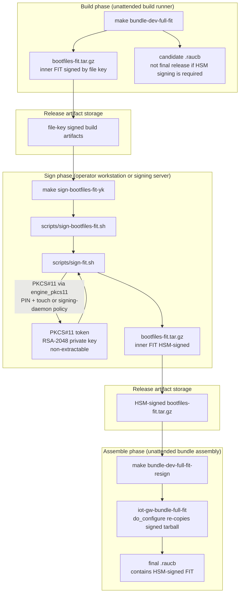
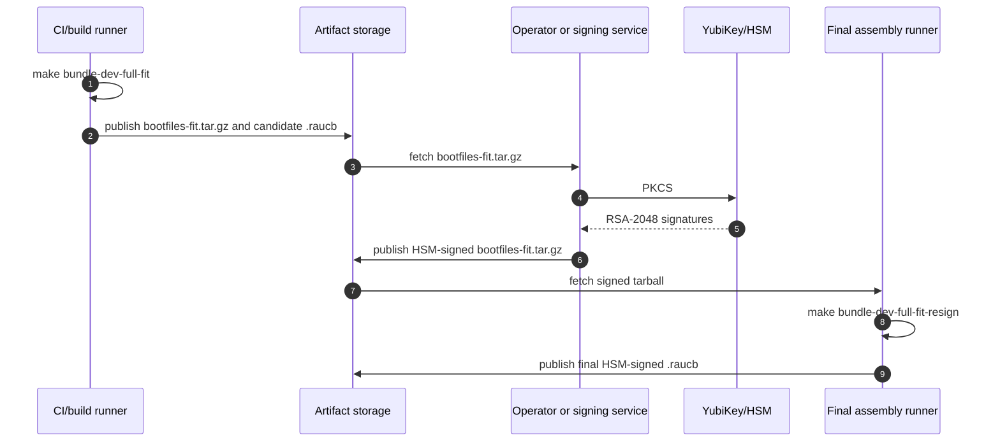

# FIT Image Setup and Signing Guide

This guide covers FIT boot flow setup, manual key generation, and FIT signature verification for the IoT Gateway project.

## Configure FIT Flow
In `kas/local.yml`, ensure FIT flow is selected:

```yaml
local_conf_header:
  kernel_mode_switch: |
    IOTGW_BOOT_FLOW = "fit"
```

Expected FIT overrides (already in this project):
- `PREFERRED_PROVIDER_virtual/kernel:fitflow = "linux-iotgw-mainline-fit"`
- `KERNEL_IMAGETYPE:fitflow = "fitImage"`
- `KERNEL_CLASSES:fitflow = " kernel-fitimage "`
- `KERNEL_BOOTCMD:fitflow = "bootm"`

### Optional: Enable Project-Owned Custom ITS
Default behavior remains Yocto auto-generated ITS. To opt in to project-owned
custom ITS mode:

```yaml
local_conf_header:
  fit_custom_its: |
    IOTGW_FIT_CUSTOM_ITS:fitflow = "1"
```

Notes:
- Default is `0` (OFF).
- Template path:
  `meta-iot-gateway/recipes-kernel/linux/files/iotgw-fit-single.its.in`
- Current template targets `broadcom/bcm2712-rpi-5-b.dtb` by default.
- Current template supports multi-config layout:
  - kernels: `kernel-1`, `kernel-2`
  - configs: `conf-primary` (primary), `conf-recovery` (secondary)

Optional custom ITS selection overrides:

```yaml
local_conf_header:
  fit_custom_its: |
    IOTGW_FIT_CUSTOM_ITS:fitflow = "1"
    IOTGW_FIT_CUSTOM_ITS_DEFAULT_CONF:fitflow = "conf-primary"
    # Default kernel-2 mode: auto-generate from local build artifacts.
    IOTGW_FIT_CUSTOM_ITS_KERNEL2_COMP_ALG:fitflow = "gzip"
    IOTGW_FIT_CUSTOM_ITS_REQUIRE_DISTINCT_KERNELS:fitflow = "1"
    # Optional recovery-kernel mode: provide an independent kernel-2 payload.
    # IOTGW_FIT_CUSTOM_ITS_KERNEL2_PATH:fitflow = "/abs/path/to/linux-alt.bin"
    # IOTGW_FIT_CUSTOM_ITS_KERNEL2_PATH_COMP_ALG:fitflow = "gzip"  # none|gzip|lzo
```

Notes:
- `IOTGW_FIT_CUSTOM_ITS_KERNEL2_COMP_ALG` applies only to auto-generated
  kernel-2 payloads.
- `IOTGW_FIT_CUSTOM_ITS_KERNEL2_PATH_COMP_ALG` applies when
  `IOTGW_FIT_CUSTOM_ITS_KERNEL2_PATH` is set.

Concrete wiring for independent recovery-kernel mode:

```yaml
local_conf_header:
  fit_custom_its: |
    IOTGW_FIT_CUSTOM_ITS:fitflow = "1"
    IOTGW_FIT_STRATEGY_A_RECOVERY_KERNEL:fitflow = "1"
    IOTGW_FIT_RECOVERY_KERNEL_RECIPE:fitflow = "linux-iotgw-mainline-recovery"
    IOTGW_FIT_RECOVERY_KERNEL_PATH:fitflow = "${DEPLOY_DIR_IMAGE}/linux-recovery.bin"
    IOTGW_FIT_CUSTOM_ITS_KERNEL2_PATH_COMP_ALG:fitflow = "gzip"
```

When enabled:
- Recovery kernel artifact for FIT `kernel-2`: `linux-recovery.bin`
- `IOTGW_FIT_CUSTOM_ITS_KERNEL2_PATH_COMP_ALG` controls how recovery payload
  is staged in FIT (`none|gzip|lzo`). Recommended default: `gzip`.

Important compatibility note:
- If recovery boots the normal rootfs, keep recovery and primary kernel configs
  module-ABI compatible (same effective module ABI options), otherwise modules
  fail to load with `Exec format error` / `this_module` size mismatch.

## Generate FIT Signing Keys (Manual)
Use a dedicated keypair (do not reuse RAUC or mTLS keys):

```bash
FIT_KEY_DIR="${IOTGW_RAUC_KEY_DIR}/fit"  # or any secure directory
install -d -m 700 "$FIT_KEY_DIR"
openssl genrsa -out "$FIT_KEY_DIR/iotgw-fit-dev.key" 2048
openssl req -new -x509 \
  -key "$FIT_KEY_DIR/iotgw-fit-dev.key" \
  -out "$FIT_KEY_DIR/iotgw-fit-dev.crt" \
  -days 3650 \
  -subj "/CN=iotgw-fit-dev/O=IoT Gateway Dev/OU=FIT Signing"
chmod 600 "$FIT_KEY_DIR/iotgw-fit-dev.key"
chmod 644 "$FIT_KEY_DIR/iotgw-fit-dev.crt"
```

## Enable FIT Signing in Local Config
In `kas/local.yml` (local-only, gitignored), use the project's `fit_signing_dev` block:

```yaml
local_conf_header:
  fit_signing_dev: |
    IOTGW_FIT_SIGNING = "1"
    IOTGW_FIT_SIGN_MODE = "rsa"
    UBOOT_SIGN_ENABLE:fitflow = "1"
    FIT_HASH_ALG:fitflow = "sha256"
    FIT_SIGN_ALG:fitflow = "rsa2048"
    FIT_GENERATE_KEYS:fitflow = "0"
    UBOOT_SIGN_KEYDIR:fitflow = "/path/to/your/fit-keys"
    UBOOT_SIGN_KEYNAME:fitflow = "iotgw-fit-dev"
```

Notes:
- `FIT_GENERATE_KEYS = "0"` keeps key management manual.
- Non-FIT flow remains unaffected.
- Replace `/path/to/your/fit-keys` with your actual key directory.
- This project currently validates FIT signing/verification with RSA.
- ECDSA path is not validated in this repository yet; do not treat it as a
  supported/verified production path.

## Ensure U-Boot Supports FIT Signature Verification
This project enables required U-Boot options via:
- `meta-iot-gateway/recipes-bsp/u-boot/files/iotgw-uboot.cfg`

Relevant options include:
- `CONFIG_FIT=y`
- `CONFIG_FIT_SIGNATURE=y`
- `CONFIG_RSA=y`
- `CONFIG_RSA_PUBLIC_KEY_PARSER=y`
- `CONFIG_SHA256=y`

## Build Signed FIT Bundle
Force rebuild of U-Boot and kernel artifacts after signing changes:

```bash
kas shell kas/local.yml -c 'bitbake -c cleansstate u-boot virtual/kernel'
make bundle-dev-full-fit
```

## Verify Signed FIT on Host
Check FIT structure:

```bash
dumpimage -l build/tmp-glibc/deploy/images/raspberrypi5/fitImage
```

Expected:
- kernel and FDT entries present
- hash nodes present (sha256)
- signature-related fields present when signing is enabled

If custom ITS mode is enabled, also inspect deployed ITS source:

```bash
ls build/tmp-glibc/deploy/images/raspberrypi5/fitImage-its-*.its
grep -nE 'kernel-1|kernel-2|configurations|default =|conf-primary|conf-recovery' \
  build/tmp-glibc/deploy/images/raspberrypi5/fitImage-its-*.its
```

Confirm kernel variants are distinct:

```bash
dumpimage -l build/tmp-glibc/deploy/images/raspberrypi5/fitImage | \
  grep -E 'Image [0-9] \(kernel-|Compression:|Hash value:'
```

Expected:
- Recovery-kernel mode enabled (`IOTGW_FIT_STRATEGY_A_RECOVERY_KERNEL = "1"`):
  - `kernel-1`: primary kernel payload
  - `kernel-2`: recovery payload from `linux-recovery.bin`
- Recovery-kernel mode disabled:
  - `kernel-2` is auto-generated according to
    `IOTGW_FIT_CUSTOM_ITS_KERNEL2_COMP_ALG`

Runtime config selection: by default `iotgw_fit_conf` is **unset** and
U-Boot boots the FIT's own signed `default` configuration (`bootm` with
no explicit `#conf`) — the config name is not duplicated anywhere in the
environment or OTA hooks. Setting the variable is an operator override
for non-default configs. The OTA bundle hook clears the variable on
every install, so an override does not survive an update:

```bash
fw_printenv iotgw_fit_conf          # expect: not defined
fw_setenv iotgw_fit_conf conf-recovery
reboot
```

Verify FIT bundle payload uses FIT bootfiles:

```bash
tmpd=$(mktemp -d)
7z x -y -o"$tmpd" build/tmp-glibc/deploy/images/raspberrypi5/iot-gw-image-dev-bundle-full-fit.raucb >/dev/null
sed -n '1,200p' "$tmpd/manifest.raucm"
tar -tzf "$tmpd/bootfiles-fit.tar.gz" | grep -E 'boot.scr|fitImage'
rm -rf "$tmpd"
```

## Install and Verify on Target
Install bundle and reboot:

```bash
iotgw-rauc-install <url>/iot-gw-image-dev-bundle-full-fit.raucb
reboot
```

Validate boot mode:

```bash
strings /boot/boot.scr | grep -E "Image:|fatload|bootm|booti"
ls -l /boot/fitImage /boot/Image
rauc status
```

Expected:
- `Image: fitImage`
- `fatload ... fitImage`
- `bootm ...`
- `/boot/fitImage` exists

Check U-Boot log for verification path:
- FIT configuration selected
- hash verification success lines
- no `Bad Data Hash` / `Unsupported hash algorithm`

Quick functional checks after booting `conf-recovery`:

```bash
lsmod | head
ip -4 a
dmesg | grep -E "this_module|Exec format error|Bad Data Hash|Unsupported hash algorithm"
```

Expected:
- modules load normally (`lsmod` non-empty)
- recovery network interfaces are present
- no module ABI mismatch errors

## Negative Test (Tamper Protection)
Goal: confirm tampered FIT does not boot.

Suggested method:
1. Backup `/boot/fitImage` on target.
2. Modify one byte in `/boot/fitImage`.
3. Reboot and confirm U-Boot verification failure.
4. Restore backup and reboot.

Example (careful, test device only):

```bash
cp /boot/fitImage /boot/fitImage.bak
printf '\x00' | dd of=/boot/fitImage bs=1 seek=4096 count=1 conv=notrunc
sync
reboot
```

Expected failure symptoms in U-Boot log:
- hash/signature verification error
- kernel not booted

## Production Notes
- Use separate production FIT signing keys.
- Keep production private keys offline/HSM-managed.
- Do not commit keys into repository.
- Keep RAUC signing keys and FIT signing keys separate.

## Signing tooling

FIT signing is driven by `scripts/sign_fit.py`. The Python tool replaces
the earlier bash wrappers (`sign-fit.sh`, `sign-bootfiles-fit.sh`),
which now remain as compatibility shims so existing operator runbooks
and Make targets keep working unchanged.

### Subcommands

```
sign_fit.py sign-fit          --profile NAME --fit PATH       [--verify] [--rewrite-only]
sign_fit.py sign-bootfiles    --profile NAME --archive PATH   [--force]  [--verify]
sign_fit.py verify            --fit PATH --dtb PATH           [--fit-check-sign-path PATH]
sign_fit.py print-profile     --profile NAME                  [--profile-config PATH]
```

`sign-fit` and `sign-bootfiles` invoke
`mkimage -F -N pkcs11 -k <profile.uri>` under the hood; `verify` calls
`fit_check_sign` against a supplied DTB for a real RSA signature check
(distinct from the structural `--verify` flag, which only inspects
audit metadata).

### Signing profiles

Each profile bundles the FIT key-name-hint, the PKCS#11 lookup URI, and
the OpenSSL engine_pkcs11 config. Defaults ship in
`scripts/fit-signing-profiles.yml` (YAML is used here for consistency
with the kas overlay files):

```yaml
fit_signing_profiles:
  yubikey-9a:
    key_name_hint: "iotgw-fit-yk-2026"
    uri: "pkcs11:object=Private%20key%20for%20PIV%20Authentication"
    engine_conf: "~/rauc-keys/rauc-ca/fit/openssl-engine.cnf"

  softhsm-dev:
    key_name_hint: "iotgw-fit-softhsm-dev"
    uri: "pkcs11:object=iotgw-fit-softhsm-dev"
    engine_conf: "~/rauc-keys/softhsm/fit/openssl-engine.cnf"
```

Override the config file path with `--profile-config <path>` or the
`IOTGW_FIT_SIGNING_PROFILES` environment variable. Individual fields
can be overridden with `--key-name-hint`, `--uri`, `--engine-conf`.
`--print-profile` resolves a profile (with overrides applied) and
prints it without signing — useful for diagnostics.

PyYAML is the only Python runtime dependency. Install via the distro
package (`apt install python3-yaml` on Debian/Ubuntu,
`dnf install python3-pyyaml` on Fedora) or `pip install pyyaml`.

### Reproducible test environment (optional)

For running the test suite under `scripts/tests/` we ship a
[uv](https://docs.astral.sh/uv/)-managed Python environment so PyYAML
and pytest versions are pinned via `uv.lock`. This does NOT replace
the operator-facing CLI — `scripts/sign_fit.py` keeps working against
the system Python and a distro-installed `python3-yaml`. Yocto/BitBake
builds do not depend on uv.

```bash
# One-time setup (Ubuntu 24.04 — uv ships via apt; see uv docs for
# other distros or the official install method).
sudo apt install uv

# Sync the venv (.venv at the repo root, gitignored). Run after a
# fresh clone or after bumping pyproject.toml / uv.lock.
make tools-venv

# Run the test suite. SoftHSM tests skip cleanly when no SoftHSM
# token is on the host.
make test-sign-fit

# Run the full suite including SoftHSM integration tests. Requires
# `softhsm2` + `libengine-pkcs11-openssl` on the host.
make test-sign-fit-softhsm
```

### Make targets

| Target | Profile | When to use |
|--------|---------|-------------|
| `make sign-bootfiles-fit-yk` | `yubikey-9a` | Production release flow. Requires a YubiKey with slot 9a provisioned. Prompts for PIN, requires touch. |
| `make sign-bootfiles-fit-softhsm` | `softhsm-dev` | Dev flow for engineers without a YubiKey. Requires the SoftHSM dev key provisioned (see below). |

Both targets accept `SIGN_BOOTFILES_ARGS` and `SIGN_FIT_ARGS` env vars
for ad-hoc flags. Example:

```bash
make sign-bootfiles-fit-yk SIGN_FIT_ARGS=--verify
make sign-bootfiles-fit-softhsm SIGN_BOOTFILES_ARGS=--force
```

### SoftHSM dev provisioning (one-time, dev-only)

SoftHSM is a software PKCS#11 token — keys live on disk, not in
hardware. It enables YubiKey-free dev signing for engineers without
hardware tokens. **Never use SoftHSM-signed artifacts on production
images**; the corresponding DTB trust gate
(`IOTGW_FIT_TRUST_SOFTHSM_KEY`) is dev-only.

The distro `softhsm2` package (Debian/Ubuntu/Fedora 2.6.x) is
sufficient. Engineers building SoftHSM 2.7.0 locally point the
operator tooling at it by editing the `MODULE_PATH` line in the
profile's engine config file (`~/rauc-keys/softhsm/fit/openssl-engine.cnf`
in the default profile). `sign_fit.py` consumes the path indirectly
via OpenSSL's engine_pkcs11 — there is no Python-side env var that
overrides it.

(`IOTGW_SOFTHSM_MODULE` is consulted only by the pytest suite in
`scripts/tests/conftest.py` for SoftHSM module discovery when
running tests against a non-distro build. It does not affect the
operator-facing `sign_fit.py`.)

Initial provisioning:

```bash
# 1. Isolated token store under the operator vault.
SOFTHSM_BASE="$HOME/rauc-keys/softhsm"
install -d -m 700 "$SOFTHSM_BASE/tokens" "$SOFTHSM_BASE/fit"
cat > "$SOFTHSM_BASE/softhsm2.conf" <<EOF
directories.tokendir = $SOFTHSM_BASE/tokens
objectstore.backend = file
EOF
export SOFTHSM2_CONF="$SOFTHSM_BASE/softhsm2.conf"

# Locate the distro module (Debian/Ubuntu path; adjust for other distros).
SOFTHSM_MOD=/usr/lib/softhsm/libsofthsm2.so

# 2. Init a token.
softhsm2-util --module "$SOFTHSM_MOD" --init-token --free \
    --label iotgw-fit-dev --pin 1234 --so-pin 123456

# 3. Generate the dev signing keypair on the token.
pkcs11-tool --module "$SOFTHSM_MOD" --token-label iotgw-fit-dev \
    --login --pin 1234 \
    --keypairgen --key-type rsa:2048 \
    --label iotgw-fit-softhsm-dev --id 01

# 4. OpenSSL engine_pkcs11 config.
cat > "$SOFTHSM_BASE/fit/openssl-engine.cnf" <<EOF
openssl_conf = openssl_init

[openssl_init]
engines = engine_section

[engine_section]
pkcs11 = pkcs11_section

[pkcs11_section]
engine_id = pkcs11
dynamic_path = /usr/lib/x86_64-linux-gnu/engines-3/pkcs11.so
MODULE_PATH = $SOFTHSM_MOD
init = 0
EOF

# 5. Self-sign a cert against the on-token key (no private key on disk).
OPENSSL_CONF="$SOFTHSM_BASE/fit/openssl-engine.cnf" \
openssl req -new -x509 \
    -engine pkcs11 -keyform engine \
    -key "pkcs11:object=iotgw-fit-softhsm-dev;type=private;pin-value=1234" \
    -days 3650 \
    -subj "/CN=iotgw-fit-softhsm-dev/O=iotgw-dev" \
    -out "$SOFTHSM_BASE/fit/iotgw-fit-softhsm-dev.crt"
```

After provisioning, persist `SOFTHSM2_CONF` in your shell init so every
subsequent `make sign-bootfiles-fit-softhsm` invocation finds the
token.

The default profile expects the engine config at
`~/rauc-keys/softhsm/fit/openssl-engine.cnf` and the cert at
`~/rauc-keys/softhsm/fit/iotgw-fit-softhsm-dev.crt`. To use a
different layout, copy `scripts/fit-signing-profiles.yml` to a vault
location, edit the SoftHSM profile, and export
`IOTGW_FIT_SIGNING_PROFILES=<path>`.

## DTB trust rotation: file key → YubiKey

The U-Boot **control FDT** (the runtime DTB the RPi firmware passes to
U-Boot) holds the public keys U-Boot trusts when verifying FIT
signatures at boot. Rotating from a file-key-only trust root to a
hardware-resident YubiKey pubkey is the second leg of FIT-signing
adoption: PR-side HSM signing produces FITs that only verify on devices
whose control FDT carries the corresponding pubkey.

This project ships a three-stage rotation pattern modelled after the
RAUC PKI rotation (see `docs/RAUC_PKI.md`), plus an optional dev variant
that adds a SoftHSM-resident trust root for engineers without a
YubiKey:

| Stage | DTB trust roots | FIT signing key | Notes |
|-------|-----------------|-----------------|-------|
| Legacy baseline | file key only | file key | Status quo before this rotation. |
| **Rotation window** | **file key + YK pubkey** | file key (build) or YK (post-build, optional) | DTB carries both pubkeys with `/signature/required-mode = "any"`. A FIT signed by either root verifies. |
| Production cutover | YK pubkey only | YK (post-build, mandatory) | File key retired via the `kas/fit-release-trust.yml` release overlay (`IOTGW_FIT_TRUST_FILE_KEY:fitflow = "0"`; SoftHSM forced off too). |
| Dev variant (optional) | adds SoftHSM dev pubkey alongside any of the above | YK (production) or SoftHSM (dev) | `IOTGW_FIT_TRUST_SOFTHSM_KEY = "1"`. **Dev hardware only — never ship.** |

The rotation-window build is the only one that should ship while
operators still hold the legacy file-key private material. Devices
that boot it will accept any future YK-signed FIT, so the rotation can
proceed without re-flashing.

The Dev variant is a dev-loop tool: enable
`IOTGW_FIT_TRUST_SOFTHSM_KEY` alongside the YK gate to build an image
that boots either a real YK-signed FIT or a SoftHSM-signed FIT — useful
for shared dev hardware between YK-equipped and YK-less engineers.
No production build should carry the SoftHSM trust gate — devices in
the field must trust only YubiKey-backed roots.

### Operator pre-flight: export the YK public certificate

The build host needs the public certificate from slot 9a. **No private
key is exported, ever.** Capture once into the operator key tree:

```bash
KEY_DIR="${IOTGW_RAUC_KEY_DIR}/rauc-ca/fit"
install -d -m 700 "$KEY_DIR"
ykman piv certificates export 9a "$KEY_DIR/iotgw-fit-yk-2026.crt"
chmod 644 "$KEY_DIR/iotgw-fit-yk-2026.crt"
openssl x509 -in "$KEY_DIR/iotgw-fit-yk-2026.crt" -noout -subject -dates
```

The certificate filename is `<IOTGW_FIT_YK_KEYNAME>.crt`; renaming the
YubiKey hint string in the project requires renaming this file in
lockstep. The default `iotgw-fit-yk-2026` is intentionally year-tagged
so a future rotation lands at `iotgw-fit-yk-<NEW_YEAR>` without
clobbering existing trust anchors on already-deployed rotation-window
devices.

### Build-time configuration (rotation window)

In `kas/local.yml`, enable both trust roots:

```yaml
local_conf_header:
  fit_dtb_yk_pubkey_trust: |
    IOTGW_FIT_TRUST_FILE_KEY:fitflow = "1"
    IOTGW_FIT_TRUST_YK_KEY:fitflow = "1"
    IOTGW_FIT_YK_KEYDIR:fitflow = "${IOTGW_RAUC_KEY_DIR}/rauc-ca/fit"
    IOTGW_FIT_YK_KEYNAME:fitflow = "iotgw-fit-yk-2026"
```

Force rebuild of the kernel so the deploy step re-mutates the DTBs:

```bash
kas shell kas/local.yml -c 'bitbake -c cleansstate virtual/kernel'
make bundle-dev-full-fit
```

The kernel-fit recipe's `do_deploy:append` block:

- Loops over `RPI_KERNEL_DEVICETREE` DTBs.
- When `IOTGW_FIT_TRUST_FILE_KEY = "1"`: runs `mkimage -F -k -K -r` to
  sign the FIT with the file key AND inject the file-key public key
  into the DTB under `/signature/key-<UBOOT_SIGN_KEYNAME>`.
- When `IOTGW_FIT_TRUST_YK_KEY = "1"`: runs
  `fdt_add_pubkey -a ${FIT_HASH_ALG},${FIT_SIGN_ALG} -k <yk-keydir> -n <yk-keyname> -r conf`
  to add a second key node under `/signature/key-<IOTGW_FIT_YK_KEYNAME>`
  (no private key required).
- When `IOTGW_FIT_TRUST_SOFTHSM_KEY = "1"`: same shape as the YK
  injection but using `<softhsm-keydir>` and `<softhsm-keyname>`. Dev
  builds only.
- Counts how many of the three trust gates are enabled. If more than
  one, sets `/signature/required-mode = "any"` via `fdtput` so a FIT
  signed by any one root verifies. With exactly one trust root,
  `required-mode` is left unset — U-Boot's default semantics handle the
  single-required-key case.

All three gates off with `UBOOT_SIGN_ENABLE=1` is fatal — the recipe
refuses to deploy unsigned-trust DTBs.

### Verifying the DTB build output

Inspect the deployed DTB:

```bash
DTB=build/tmp-glibc/deploy/images/raspberrypi5/bcm2712-rpi-5-b.dtb
fdtget -l "$DTB" /signature
fdtget    "$DTB" /signature required-mode
```

Expected output:

```
key-iotgw-fit-dev
key-iotgw-fit-yk-2026
any
```

Both `key-*` subnodes present, `required-mode = "any"`. If
`required-mode` is missing or set to `"all"` and both keys are
`required = "conf"`, a FIT signed by only one key will be rejected at
boot.

`fdtget -l` is preferred over `fdtdump | sed` because the latter can
silently truncate at the first `};` and hide a second key node.

### On-target verification

After flashing a rotation-window build and booting:

```bash
# Confirm both trust roots are live in U-Boot's control FDT.
nsenter -t 1 -m cat /sys/firmware/devicetree/base/signature/required-mode
nsenter -t 1 -m ls /sys/firmware/devicetree/base/signature/
```

Expected: `any` on stdout, and two `key-*` directories.

Test both signing paths sequentially:

1. **File-key-signed FIT path** — flash the rotation-window build,
   boot, check U-Boot log for FIT verification success against
   `key-${UBOOT_SIGN_KEYNAME}`. Normal `iotgw-rauc-install` flow works
   as it did pre-rotation.
2. **YK-signed FIT path** — run `make sign-bootfiles-fit-yk` against the
   same build to swap the inner FIT signature to slot 9a (see the next
   section), reassemble the bundle, install on the device that booted
   step 1, reboot. U-Boot must accept the FIT against
   `key-iotgw-fit-yk-2026`.

Both paths must boot cleanly on the same device before promoting the
rotation-window build to fleet rollout, and before scoping the
production cutover.

### Production cutover

The cutover build sets `IOTGW_FIT_TRUST_FILE_KEY:fitflow = "0"` and
`IOTGW_FIT_TRUST_SOFTHSM_KEY:fitflow = "0"` via the committed
`kas/fit-release-trust.yml` overlay (see the next section). The recipe
then injects only the YK pubkey, and with a single trust root
`required-mode` is left unset — U-Boot's default single-required-key
verification applies (no recipe change; same behaviour as PR #74). The
bundle FIT MUST be HSM-signed before release; a file-key-signed FIT
would be rejected by every fielded device. On-target validation of the
cutover build is still pending.

## Release vs dev KAS trust profiles

Two profiles govern which trust roots land in the U-Boot control FDT.

| Profile | `IOTGW_FIT_TRUST_FILE_KEY` | DTB trust roots | `required-mode` |
|---------|---------------------------|-----------------|-----------------|
| **Dev** (default) | `1` | file key + YubiKey/SoftHSM pubkey(s) | `any` (multi-root) |
| **Release** | `0` | YubiKey pubkey only | unset (single root) |

The release profile also forces `IOTGW_FIT_TRUST_SOFTHSM_KEY:fitflow = "0"`,
so a developer's `kas/local.yml` with all three trust roots enabled cannot
leak the SoftHSM dev key into a release DTB.

### Dev profile

The default. `IOTGW_FIT_TRUST_FILE_KEY` defaults to `"1"` in the
recipe, so no kas overlay change is needed for dev builds. The dev
profile is the multi-root rotation-window configuration where a FIT
signed by any enabled trust root verifies at boot.

### Release profile

`kas/fit-release-trust.yml` is a committed overlay that sets
`IOTGW_FIT_TRUST_FILE_KEY:fitflow = "0"` and
`IOTGW_FIT_TRUST_SOFTHSM_KEY:fitflow = "0"` — the file key and the
dev-only SoftHSM key are both dropped, leaving the YubiKey pubkey as the
sole trust root. Forcing SoftHSM off matters because a developer's
`kas/local.yml` may enable all three roots; without it a release build
composed on that config would carry the SoftHSM dev key in the DTB. The
`:fitflow` override qualifier is required: `kas/local.yml` scopes every
FIT trust gate to that override, and a bare assignment would be shadowed
by it. The overlay is composed automatically with `prod`,
`bundle-prod-full`, and `bundle-prod-full-fit` by the `Makefile` whenever
the file exists (the same pattern as `kas/uboot-prod-hardening.yml`), and
after `kas/local.yml` so the override-tier assignments win. A release
build therefore picks up the release trust profile without any manual
`kas/local.yml` change.

Safety gate: with `IOTGW_FIT_TRUST_FILE_KEY:fitflow = "0"`, if
`IOTGW_FIT_TRUST_YK_KEY` is also not `"1"`, the recipe `bbfatal`s at
`do_deploy` time. `iotgw-uboot-prod-key-guard.bbclass` enforces the same
invariant earlier and independently: it fails any prod build
(`iot-gw-image-prod` / `appliance_lockdown`) whose trust gates are not
the release set — file and SoftHSM off, YubiKey on — before
`do_configure`. Release builds require a YubiKey trust root. Ensure
`kas/local.yml` (or another composed overlay) sets:

```yaml
local_conf_header:
  fit_dtb_yk_pubkey_trust: |
    IOTGW_FIT_TRUST_YK_KEY:fitflow = "1"
    IOTGW_FIT_YK_KEYDIR:fitflow = "${IOTGW_RAUC_KEY_DIR}/rauc-ca/fit"
    IOTGW_FIT_YK_KEYNAME:fitflow = "iotgw-fit-yk-2026"
```

Verifying the release DTB output:

```bash
DTB=build/tmp-glibc/deploy/images/raspberrypi5/bcm2712-rpi-5-b.dtb
fdtget -l "$DTB" /signature       # exactly one subnode: key-iotgw-fit-yk-2026
fdtget -p "$DTB" /signature       # property list must NOT include required-mode
```

With a single trust root the recipe leaves `required-mode` unset, so
`fdtget "$DTB" /signature required-mode` errors with "not found" — that
absence is the expected result, not a failure.

### Supported release artifacts under the release profile

Under the release profile, `make prod` does **not** produce a final
flashable SD image. The `.wic.zst` it deposits in `${DEPLOY_DIR_IMAGE}`
contains a `/boot/fitImage` that is still **file-key signed** by the
kernel recipe at build time — the DTB on the same image only trusts the
YubiKey root, so flashing that WIC fails U-Boot FIT verification on the
first boot cycle and exhausts both RAUC slots. This is the failure class
tracked as **issue #83**.

The detached HSM signing flow (`make sign-bootfiles-fit-yk`) finalizes
bootfiles for **RAUC bundle delivery only**. It re-signs the FIT inside
`bootfiles-fit.tar.gz` so the bundle's OTA install hook
(`bundle-hooks-fit.sh`) writes a YubiKey-signed `/boot/fitImage-{a,b}`
to the target's existing boot partition. It does **not** touch the
WIC's `/boot/fitImage` baked into the SD image.

The supported release artifact is therefore the **resigned RAUC bundle**:

```bash
make bundle-prod-full-fit            # build with file-key FIT
make sign-bootfiles-fit-yk           # YK + PIN + touch; re-signs bootfiles tarball
make bundle-prod-full-fit-resign     # reassembles .raucb around the re-signed tarball
```

The output `iot-gw-image-prod-bundle-full-fit.raucb` is the deliverable
for field rollout — install it on a device that was previously
provisioned (initial flash via a dev or dual-trust SD image, then OTA'd
into release-trust). Signed production initial-flash SD images are not
currently part of the supported flow; the field path is dev/dual-trust
SD → OTA to release-trust bundle.

The `iotgw-rauc-image.bbclass` carries a parse-time anonymous Python
guard that emits a `bb.warn` whenever a WIC-producing image recipe is
parsed under release-trust (i.e. `IMAGE_FSTYPES` contains a `wic`
variant, `IOTGW_FIT_TRUST_FILE_KEY="0"`, and `IOTGW_FIT_TRUST_YK_KEY="1"`).
The check runs at every `bitbake` invocation against an affected image
recipe — including sstate-covered rebuilds where task prefuncs would be
bypassed. The warning names the unbootable artifact and points at this
workflow; it is loud-by-design. If you have suppressed it locally,
you've also taken on responsibility for not flashing the resulting
`.wic.zst`.

## Signing FIT against a PKCS#11 token (YubiKey)

The default flow above signs the FIT inside bitbake against a file-based
RSA key under `UBOOT_SIGN_KEYDIR`. The HSM-backed flow moves the FIT
signing key to a PKCS#11 token (the YubiKey PIV slot 9a in this
repository's example, RSA-2048) and performs the signing as a
**post-build** step. The bitbake-side signer stays file-based; only the
deploy artifact is re-signed.

### Why not sign inside bitbake

mkimage 2025.04's `-N pkcs11` code path has three behaviours that
together make in-bitbake PKCS#11 signing unworkable and constrain even
post-build wrapper use:

1. **`-G` is ignored entirely.** `lib/rsa/rsa-sign.c`'s
   `rsa_engine_get_priv_key()` never references `params.keyfile`
   inside the pkcs11 branch. The URI mkimage actually uses is built
   from `-k` (`keydir`) and the FIT's `key-name-hint` (`name`), never
   from `-G`.
2. **`-k <bare-keydir-path>` is malformed.** When `keydir` does not
   contain `object=`, mkimage synthesises
   `pkcs11:<keydir>;object=<hint>;type=private` — a non-RFC-7512 URI
   that `engine_pkcs11` rejects. Both upstream `kernel-fitimage.bbclass`
   and this project's `iotgw-fit-custom-its.bbclass` hardcode `-k`
   with a filesystem path, hitting this case.
3. **`-k <URI-containing-object=>` is the only working form.** mkimage
   takes the `keydir` verbatim and appends `;type=private`, producing
   a clean RFC-7512 URI. `scripts/sign-fit.sh` uses this form with the
   default URI pointing to libykcs11's hardcoded slot 9a label
   (`Private key for PIV Authentication`).

There is also a silent no-op trap: `mkimage -F -N pkcs11 <fit>`
without `-k` exits 0, regenerates hashes, repacks the FDT, and leaves
the original signature bytes untouched. The `sign-fit.sh` wrapper
guards against this by requiring at least one `Signature written` line
in mkimage's captured output before declaring success.

Upstream note: the meta-oe `fitimage.bbclass` available on wrynose
provides native PKCS#11 FIT signing support. This project deliberately
keeps the post-build `sign_fit.py` flow instead — HSM keys and operator
PIN/touch never enter the bitbake build environment.

### How `scripts/sign_fit.py sign-fit` works

`scripts/sign-fit.sh` is a compatibility shim that calls
`scripts/sign_fit.py sign-fit ...`. The Python implementation does three
things, in order:

1. **`fdtput` rewrite** — walks every
   `/configurations/conf-*/signature*/key-name-hint` and sets it to the
   project-controlled hint (default `iotgw-fit-yk-2026`, override with
   `--key-name-hint`). This hint must match the
   `/signature/key-<hint>` node injected into U-Boot's control FDT by
   the kernel-fit recipe — devices reject FITs whose hint doesn't
   resolve to a trusted key. It also drives the resulting `Sign algo:`
   audit line. It is **not** the key-lookup mechanism for signing.
2. **`mkimage -F -N pkcs11 -k "<uri>" <fit>`** — signs in place via
   `engine_pkcs11` against `libykcs11`. **mkimage 2025.04 ignores
   `-G` entirely in its `-N pkcs11` code path** (`lib/rsa/rsa-sign.c`
   does not reference `params.keyfile` for the pkcs11 engine), and the
   `-k` path only uses the URI verbatim when it already contains
   `object=`. For any other URI form (`id=`, `token=` without
   `object=`), mkimage rewrites it as
   `pkcs11:<keydir>;object=<key-name-hint>;type=private` — broken
   unless the FIT hint happens to equal a real libykcs11 object label.
   The default URI is therefore object-anchored to libykcs11's
   hardcoded slot 9a label:
   `pkcs11:object=Private%20key%20for%20PIV%20Authentication`.
   Slot-anchored URIs (`pkcs11:id=%01;type=private`) require a signer
   that calls OpenSSL directly rather than through mkimage's
   `-N pkcs11` path. PIN is prompted on the terminal; touch is
   required per slot 9a's touch policy (`CACHED` covers a multi-config
   signing call with one tap).
3. **Success detection + structural verify** — captures mkimage's
   output; requires at least one `Signature written` log line.
   Deterministic RSA-PKCS#1 v1.5 over the FIT signed range makes
   byte-comparison guards unreliable (re-signing the same content
   with the same key produces identical bytes), so the log line is
   the authoritative success signal. The optional `--verify` is a
   *structural* check on top: it asserts every signature node
   carries `Sign algo: sha256,rsa2048:<KEY_NAME_HINT>` and a non-empty
   `Sign value`. It does **not** cryptographically verify the
   signature against the slot's public key — for that, run
   `mkimage -V` against a DTB that embeds the expected pubkey.

The script mutates `--fit` in place. Run it against a copy of the
deploy artifact:

```bash
cp build/tmp-glibc/.../fitImage /tmp/fit-test/fitImage.yk
bash scripts/sign-fit.sh --fit /tmp/fit-test/fitImage.yk --verify
```

### What success looks like

On the serial console, a healthy verified boot under the multi-trust-root
control DTB (`required-mode=any`) prints one `error!` line per non-matching
trust root before the matching key verifies — this is expected, not a
failure:

```
   Using 'conf-bcm2712-rpi-5-b.dtb' configuration
   Verifying Hash Integrity ... sha256,rsa2048:iotgw-fit-dev-  error!
Verification failed for '<NULL>' hash node in 'conf-bcm2712-rpi-5-b.dtb' config node
sha256,rsa2048:iotgw-fit-dev-  error!
Verification failed for '<NULL>' hash node in 'conf-bcm2712-rpi-5-b.dtb' config node
sha256,rsa2048:iotgw-fit-dev+ OK
```

U-Boot tries the FIT's signature against every required key in the control
DTB (file / YubiKey / SoftHSM) until one matches; `required-mode=any` needs
exactly one `+ OK`. Only an output ending with **no** `+ OK` line (followed
by the slot being marked non-bootable) is an actual verification failure.

On a YubiKey-signed fitImage, `dumpimage -l` shows, for every
configuration:

```
Sign algo:    sha256,rsa2048:iotgw-fit-yk-2026
Sign value:   <256 bytes of fresh RSA-2048 signature>
Timestamp:    <signing time, not build time>
```

Compared against the file-signed source, the configurations'
`Sign value` bytes are entirely different and the `Timestamp` is the
post-build signing wall clock. Both keys produce 256-byte RSA-2048
signatures over the same hash, so byte-length is identical — only the
content differs.

For release evidence, capture `dumpimage -l` output and SHA-256 hashes
for the source and HSM-signed FIT artifacts in the release record.

For bundle-side evidence, extract the final `.raucb` with RAUC itself
instead of raw `unsquashfs` (encrypted verity bundles are not directly
readable as SquashFS):

```bash
DEPLOY=build/tmp-glibc/deploy/images/raspberrypi5
OUT=/tmp/iotgw-fit-bundle-check

rm -rf "$OUT"
rauc extract \
  --trust-environment \
  --keyring=/path/to/root-ca-primary.crt \
  --key=/path/to/device-decryption.key \
  "$DEPLOY/iot-gw-image-dev-bundle-full-fit.raucb" \
  "$OUT"

mkdir -p "$OUT/bootfiles"
tar -xzf "$OUT/bootfiles-fit.tar.gz" -C "$OUT/bootfiles"
sha256sum "$OUT/bootfiles-fit.tar.gz" "$DEPLOY/bootfiles-fit.tar.gz"
dumpimage -l "$OUT/bootfiles/fitImage" | \
  grep -E 'Sign algo:|Sign value:|Timestamp:'
```

### Detached signing — three independent stages

HSM signing must never sit on the critical path of an unattended build.
A CI runner or any pipeline that needs to complete without operator
intervention has to be able to produce *something* releasable without
contacting a YubiKey. The signing step is a separate ceremony — run on
a machine with the HSM physically attached, by an operator who is
present, or by a hardened signing daemon — and its output is fed back
into a final assembly step.

This repo expresses the model as three independent Make targets, none
of them prerequisites of the others:



The same trust boundary can be viewed as artifact movement:



#### Build — `make bundle-dev-full-fit` (unattended)

Same target as the file-key flow above. No HSM, no PIN, no touch.
Suitable for GitHub Actions, GitLab runners, or any unattended
pipeline. Produces the file-key-signed `.raucb` plus the deploy
`bootfiles-fit.tar.gz` whose inner FIT is file-key signed.

#### Sign — `make sign-bootfiles-fit-yk` (operator-only)

Wraps `scripts/sign-bootfiles-fit.sh`. Extracts
`deploy/.../bootfiles-fit.tar.gz`, calls `sign-fit.sh` on the inner
FIT (prompts for PIN, requires touch when the slot policy demands
one), repacks the tarball in place. Snapshot/restore semantics: if
anything fails between extract and repack, the original tarball is
restored from a `.bak` sibling.

The wrapper is idempotent. Before extracting and re-signing, it peeks
at the inner `fitImage`'s `Sign algo:` audit lines; if **every**
signature node already advertises the HSM key-name-hint
(`sha256,rsa2048:<KEY_NAME_HINT>`), the wrapper exits cleanly without
contacting the token. A fresh build produces a file-key-signed FIT, so
the audit line shows the file-key label and the wrapper signs. A
partially labelled FIT (one config matches, another still shows the
file-key label) is NOT skipped — the wrapper logs the mismatch and
re-signs all nodes, so a mixed-trust tarball never makes it to the
bundle. To override the skip and re-sign anyway, pass `--force` to the
wrapper. With the Make wrapper:

```bash
make sign-bootfiles-fit-yk SIGN_BOOTFILES_ARGS=--force
```

`SIGN_BOOTFILES_ARGS` is consumed by `sign-bootfiles-fit.sh` before
the `--` separator; `SIGN_FIT_ARGS` is forwarded to `sign-fit.sh`
after `--`.

The check is content-based: the "already labelled" signal lives
inside the artifact, not in a sidecar file. The same archive can be
moved between machines (CI → operator workstation → final-assembly
runner) and the idempotency decision is consistent everywhere. The
check inspects audit metadata (the key-name-hint embedded in each
`signature*` node), not the cryptographic signature. The
authoritative signature verification still belongs to U-Boot at boot
time, against the public key embedded in the signing DTB.

Runs **only** on a machine with the HSM physically attached — an
operator workstation or a hardened signing server. Never runs in CI.
The signing step is bounded in time and well-defined: one PIN entry,
one touch (CACHED covers all configurations in the FIT), seconds of
wall clock.

#### Assemble — `make bundle-dev-full-fit-resign` (unattended)

`bitbake -C do_configure iot-gw-bundle-full-fit`. Invalidates the
bundle recipe's `do_configure` stamp so it re-copies the now-HSM-
signed tarball from DEPLOY_DIR_IMAGE into its WORKDIR and re-runs
`do_bundle`. A few minutes; no kernel/rootfs rebuild. Can run in CI
on any runner that has the signed tarball deployed (e.g. via an
artifact pull from release storage), or locally by the operator
right after the sign phase.

#### CI / signing-server integration

For pipelines that have to be fully unattended, the only options are:

1. **Detached signing server** — a small daemon on a controlled host
   with the HSM permanently attached. It receives a signing request
   (artifact + metadata) over an authenticated channel (mTLS), runs
   the equivalent of the sign phase, returns the signed artifact.
   The PIN is pre-loaded into the daemon's session at start-up
   (operator authenticates once); touch can be CACHED with a long
   window or NEVER (lower-assurance only). The CI runner then runs
   the assemble phase.
2. **Manual handoff** — CI runs the build phase and publishes
   artifacts; a release manager pulls them to a workstation with the
   token attached, runs the sign phase, publishes the signed tarball
   back; a final CI job (or the operator) runs the assemble phase.

The repository ships only the building blocks (`sign-fit.sh`,
`sign-bootfiles-fit.sh`, the three Make targets). The signing daemon
is intentionally out of scope here — it belongs to whichever signing
infrastructure consumes this layer.

The example token policy in this repository is touch `CACHED` + PIN
`ALWAYS`, which prevents headless unattended HSM signing unless a
project explicitly chooses a relaxed signing-server policy.

### Slot 9a provisioning reference

Provision slot 9a with an RSA-2048 private key generated on-device,
create or import the matching public certificate used for U-Boot FIT
verification, and capture the YubiKey F9 attestation certificate in the
release key-management record. Private-key material must never be
exported or committed. Local engine/provider configuration and
certificates are expected to live outside the repository, for example
under an operator-controlled key directory.
