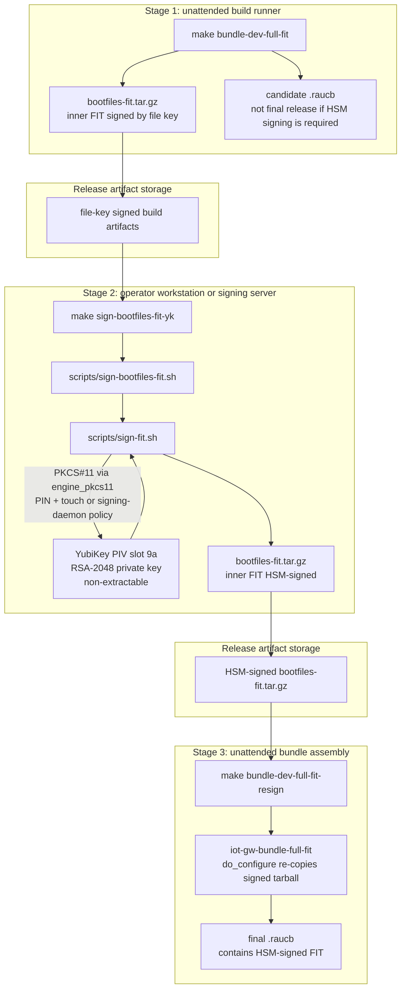
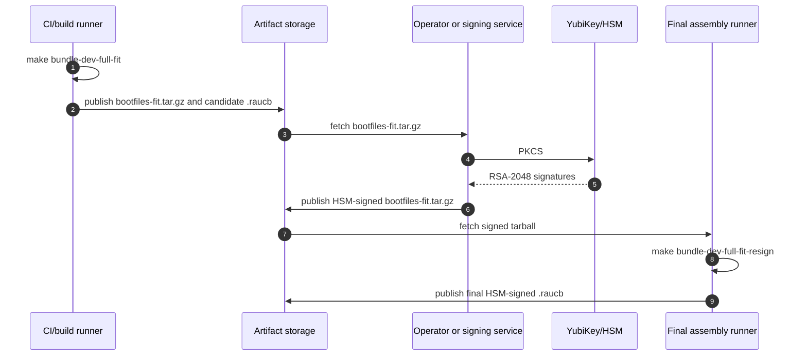

# FIT Image Setup and Signing Guide

This guide covers FIT boot flow setup, manual key generation, and FIT signature verification for the IoT Gateway project.

## Configure FIT Flow
In `kas/local.yml`, ensure FIT flow is selected:

```yaml
local_conf_header:
  kernel_mode_switch: |
    IOTGW_BOOT_FLOW = "fit"
```

Expected FIT overrides (already in this project):
- `PREFERRED_PROVIDER_virtual/kernel:fitflow = "linux-iotgw-mainline-fit"`
- `KERNEL_IMAGETYPE:fitflow = "fitImage"`
- `KERNEL_CLASSES:fitflow = " kernel-fitimage "`
- `KERNEL_BOOTCMD:fitflow = "bootm"`

### Optional: Enable Project-Owned Custom ITS
Default behavior remains Yocto auto-generated ITS. To opt in to project-owned
custom ITS mode:

```yaml
local_conf_header:
  fit_custom_its: |
    IOTGW_FIT_CUSTOM_ITS:fitflow = "1"
```

Notes:
- Default is `0` (OFF).
- Template path:
  `meta-iot-gateway/recipes-kernel/linux/files/iotgw-fit-single.its.in`
- Current template targets `broadcom/bcm2712-rpi-5-b.dtb` by default.
- Current template supports multi-config layout:
  - kernels: `kernel-1`, `kernel-2`
  - configs: `conf-primary` (primary), `conf-recovery` (secondary)

Optional custom ITS selection overrides:

```yaml
local_conf_header:
  fit_custom_its: |
    IOTGW_FIT_CUSTOM_ITS:fitflow = "1"
    IOTGW_FIT_CUSTOM_ITS_DEFAULT_CONF:fitflow = "conf-primary"
    # Default kernel-2 mode: auto-generate from local build artifacts.
    IOTGW_FIT_CUSTOM_ITS_KERNEL2_COMP_ALG:fitflow = "gzip"
    IOTGW_FIT_CUSTOM_ITS_REQUIRE_DISTINCT_KERNELS:fitflow = "1"
    # Optional recovery-kernel mode: provide an independent kernel-2 payload.
    # IOTGW_FIT_CUSTOM_ITS_KERNEL2_PATH:fitflow = "/abs/path/to/linux-alt.bin"
    # IOTGW_FIT_CUSTOM_ITS_KERNEL2_PATH_COMP_ALG:fitflow = "gzip"  # none|gzip|lzo
```

Notes:
- `IOTGW_FIT_CUSTOM_ITS_KERNEL2_COMP_ALG` applies only to auto-generated
  kernel-2 payloads.
- `IOTGW_FIT_CUSTOM_ITS_KERNEL2_PATH_COMP_ALG` applies when
  `IOTGW_FIT_CUSTOM_ITS_KERNEL2_PATH` is set.

Concrete wiring for independent recovery-kernel mode:

```yaml
local_conf_header:
  fit_custom_its: |
    IOTGW_FIT_CUSTOM_ITS:fitflow = "1"
    IOTGW_FIT_STRATEGY_A_RECOVERY_KERNEL:fitflow = "1"
    IOTGW_FIT_RECOVERY_KERNEL_RECIPE:fitflow = "linux-iotgw-mainline-recovery"
    IOTGW_FIT_RECOVERY_KERNEL_PATH:fitflow = "${DEPLOY_DIR_IMAGE}/linux-recovery.bin"
    IOTGW_FIT_CUSTOM_ITS_KERNEL2_PATH_COMP_ALG:fitflow = "gzip"
```

When enabled:
- Recovery kernel artifact for FIT `kernel-2`: `linux-recovery.bin`
- `IOTGW_FIT_CUSTOM_ITS_KERNEL2_PATH_COMP_ALG` controls how recovery payload
  is staged in FIT (`none|gzip|lzo`). Recommended default: `gzip`.

Important compatibility note:
- If recovery boots the normal rootfs, keep recovery and primary kernel configs
  module-ABI compatible (same effective module ABI options), otherwise modules
  fail to load with `Exec format error` / `this_module` size mismatch.

## Generate FIT Signing Keys (Manual)
Use a dedicated keypair (do not reuse RAUC or mTLS keys):

```bash
FIT_KEY_DIR="${IOTGW_RAUC_KEY_DIR}/fit"  # or any secure directory
install -d -m 700 "$FIT_KEY_DIR"
openssl genrsa -out "$FIT_KEY_DIR/iotgw-fit-dev.key" 2048
openssl req -new -x509 \
  -key "$FIT_KEY_DIR/iotgw-fit-dev.key" \
  -out "$FIT_KEY_DIR/iotgw-fit-dev.crt" \
  -days 3650 \
  -subj "/CN=iotgw-fit-dev/O=IoT Gateway Dev/OU=FIT Signing"
chmod 600 "$FIT_KEY_DIR/iotgw-fit-dev.key"
chmod 644 "$FIT_KEY_DIR/iotgw-fit-dev.crt"
```

## Enable FIT Signing in Local Config
In `kas/local.yml` (local-only, gitignored), use the project's `fit_signing_dev` block:

```yaml
local_conf_header:
  fit_signing_dev: |
    IOTGW_FIT_SIGNING = "1"
    IOTGW_FIT_SIGN_MODE = "rsa"
    UBOOT_SIGN_ENABLE:fitflow = "1"
    FIT_HASH_ALG:fitflow = "sha256"
    FIT_SIGN_ALG:fitflow = "rsa2048"
    FIT_GENERATE_KEYS:fitflow = "0"
    UBOOT_SIGN_KEYDIR:fitflow = "/path/to/your/fit-keys"
    UBOOT_SIGN_KEYNAME:fitflow = "iotgw-fit-dev"
```

Notes:
- `FIT_GENERATE_KEYS = "0"` keeps key management manual.
- Non-FIT flow remains unaffected.
- Replace `/path/to/your/fit-keys` with your actual key directory.
- This project currently validates FIT signing/verification with RSA.
- ECDSA path is not validated in this repository yet; do not treat it as a
  supported/verified production path.

## Ensure U-Boot Supports FIT Signature Verification
This project enables required U-Boot options via:
- `meta-iot-gateway/recipes-bsp/u-boot/files/iotgw-uboot.cfg`

Relevant options include:
- `CONFIG_FIT=y`
- `CONFIG_FIT_SIGNATURE=y`
- `CONFIG_RSA=y`
- `CONFIG_RSA_PUBLIC_KEY_PARSER=y`
- `CONFIG_SHA256=y`

## Build Signed FIT Bundle
Force rebuild of U-Boot and kernel artifacts after signing changes:

```bash
kas shell kas/local.yml -c 'bitbake -c cleansstate u-boot virtual/kernel'
make bundle-dev-full-fit
```

## Verify Signed FIT on Host
Check FIT structure:

```bash
dumpimage -l build/tmp-glibc/deploy/images/raspberrypi5/fitImage
```

Expected:
- kernel and FDT entries present
- hash nodes present (sha256)
- signature-related fields present when signing is enabled

If custom ITS mode is enabled, also inspect deployed ITS source:

```bash
ls build/tmp-glibc/deploy/images/raspberrypi5/fitImage-its-*.its
grep -nE 'kernel-1|kernel-2|configurations|default =|conf-primary|conf-recovery' \
  build/tmp-glibc/deploy/images/raspberrypi5/fitImage-its-*.its
```

Confirm kernel variants are distinct:

```bash
dumpimage -l build/tmp-glibc/deploy/images/raspberrypi5/fitImage | \
  grep -E 'Image [0-9] \(kernel-|Compression:|Hash value:'
```

Expected:
- Recovery-kernel mode enabled (`IOTGW_FIT_STRATEGY_A_RECOVERY_KERNEL = "1"`):
  - `kernel-1`: primary kernel payload
  - `kernel-2`: recovery payload from `linux-recovery.bin`
- Recovery-kernel mode disabled:
  - `kernel-2` is auto-generated according to
    `IOTGW_FIT_CUSTOM_ITS_KERNEL2_COMP_ALG`

To test runtime config selection on target (U-Boot env):

```bash
fw_printenv iotgw_fit_conf iotgw_fit_conf_default
fw_setenv iotgw_fit_conf conf-recovery
reboot
```

Verify FIT bundle payload uses FIT bootfiles:

```bash
tmpd=$(mktemp -d)
7z x -y -o"$tmpd" build/tmp-glibc/deploy/images/raspberrypi5/iot-gw-image-dev-bundle-full-fit.raucb >/dev/null
sed -n '1,200p' "$tmpd/manifest.raucm"
tar -tzf "$tmpd/bootfiles-fit.tar.gz" | grep -E 'boot.scr|fitImage'
rm -rf "$tmpd"
```

## Install and Verify on Target
Install bundle and reboot:

```bash
iotgw-rauc-install <url>/iot-gw-image-dev-bundle-full-fit.raucb
reboot
```

Validate boot mode:

```bash
strings /boot/boot.scr | grep -E "Image:|fatload|bootm|booti"
ls -l /boot/fitImage /boot/Image
rauc status
```

Expected:
- `Image: fitImage`
- `fatload ... fitImage`
- `bootm ...`
- `/boot/fitImage` exists

Check U-Boot log for verification path:
- FIT configuration selected
- hash verification success lines
- no `Bad Data Hash` / `Unsupported hash algorithm`

Quick functional checks after booting `conf-recovery`:

```bash
lsmod | head
ip -4 a
dmesg | grep -E "this_module|Exec format error|Bad Data Hash|Unsupported hash algorithm"
```

Expected:
- modules load normally (`lsmod` non-empty)
- recovery network interfaces are present
- no module ABI mismatch errors

## Negative Test (Tamper Protection)
Goal: confirm tampered FIT does not boot.

Suggested method:
1. Backup `/boot/fitImage` on target.
2. Modify one byte in `/boot/fitImage`.
3. Reboot and confirm U-Boot verification failure.
4. Restore backup and reboot.

Example (careful, test device only):

```bash
cp /boot/fitImage /boot/fitImage.bak
printf '\x00' | dd of=/boot/fitImage bs=1 seek=4096 count=1 conv=notrunc
sync
reboot
```

Expected failure symptoms in U-Boot log:
- hash/signature verification error
- kernel not booted

## Production Notes
- Use separate production FIT signing keys.
- Keep production private keys offline/HSM-managed.
- Do not commit keys into repository.
- Keep RAUC signing keys and FIT signing keys separate.

## YubiKey Post-Build Signing (Stage 2)

The default flow above signs the FIT inside bitbake against a file-based
RSA key under `UBOOT_SIGN_KEYDIR`. The HSM-backed flow moves the FIT
signing key onto a YubiKey (PIV slot 9a, RSA-2048) and performs the
signing as a **post-build** step. The bitbake-side signer stays
file-based; only the deploy artifact is re-signed.

### Why not sign inside bitbake

Two interacting mkimage bugs make in-bitbake PKCS#11 signing
unworkable as of u-boot-tools-native 2025.04:

1. **URI synthesis from `-k` is malformed.** When `mkimage` is given
   both `-k <keydir>` and `-N pkcs11`, it synthesises a non-RFC-7512
   PKCS#11 URI of the form `pkcs11:<keydir>;object=<hint>;type=private`.
   `engine_pkcs11` rejects it.
2. **`-G` is ignored when `-k` is present.** `lib/rsa/rsa-sign.c`
   prioritises the keydir path. Both upstream
   `kernel-fitimage.bbclass` and this project's
   `iotgw-fit-custom-its.bbclass` hardcode `-k`, and
   `UBOOT_MKIMAGE_SIGN_ARGS` is appended *after* `-k`, so a
   `kas/local.yml`-level override cannot reach the working `-G` path.

There is also a silent no-op trap in the no-`-k` path:
`mkimage -F -N pkcs11 <fit>` without `-k` **and** without `-G` exits 0,
regenerates hashes, repacks the FDT, and leaves the original signature
bytes untouched. The `sign-fit.sh` wrapper guards against this by
comparing Sign values pre/post.

Upstream migration note: the meta-oe `fitimage.bbclass` merged
post-Scarthgap provides native PKCS#11 FIT signing support and is the
intended migration target once this project moves beyond its current
Scarthgap layer set.

### How `scripts/sign-fit.sh` works

The wrapper does three things, in order:

1. **`fdtput` rewrite** — walks every
   `/configurations/conf-*/signature*/key-name-hint` and sets it to the
   libykcs11 CKA_LABEL exposed by the slot (default
   `"Private key for PIV Authentication"` for PIV 9a). This is the
   string that ends up in the resulting `Sign algo:` audit line; it is
   **not** the key-lookup mechanism.
2. **`mkimage -F -N pkcs11 -G "<uri>" <fit>`** — signs in place via
   `engine_pkcs11` against `libykcs11`. The PKCS#11 URI passed via
   `-G` is the actual lookup mechanism. Default URI is built from
   `--key-label` (`pkcs11:object=<url-encoded label>;type=private`);
   override `--uri` for token-anchored URIs in multi-YubiKey setups.
   PIN is prompted on the terminal; touch is required per slot 9a's
   touch policy (`CACHED` covers a multi-config signing call with one
   tap).
3. **Bytes-changed guard + structural verify** — captures Sign value
   bytes before mkimage, dies if unchanged after. The optional
   `--verify` is a *structural* check only — it asserts
   `Sign algo: sha256,rsa2048:<KEY_LABEL>` and a non-empty Sign value.
   It does **not** cryptographically verify against the slot pubkey.
   For full crypto verification, run `mkimage -V` against a DTB
   carrying the expected pubkey.

Typical invocation against a COPY of the deploy artifact (never the
deploy FIT directly — see warning below):

```bash
cp build/tmp-glibc/.../fitImage /tmp/fit-test/fitImage.yk
bash scripts/sign-fit.sh --fit /tmp/fit-test/fitImage.yk --verify
```

### What success looks like

On a YubiKey-signed fitImage, `dumpimage -l` shows, for every
configuration:

```
Sign algo:    sha256,rsa2048:Private key for PIV Authentication
Sign value:   <256 bytes of fresh RSA-2048 signature>
Timestamp:    <signing time, not build time>
```

Compared against the file-signed source, the configurations'
`Sign value` bytes are entirely different and the `Timestamp` is the
post-build signing wall clock. Both keys produce 256-byte RSA-2048
signatures over the same hash, so byte-length is identical — only the
content differs.

For release evidence, capture `dumpimage -l` output and SHA-256 hashes
for the source and HSM-signed FIT artifacts in the release record.

For bundle-side evidence, extract the final `.raucb` with RAUC itself
instead of raw `unsquashfs` (encrypted verity bundles are not directly
readable as SquashFS):

```bash
DEPLOY=build/tmp-glibc/deploy/images/raspberrypi5
OUT=/tmp/iotgw-fit-bundle-check

rm -rf "$OUT"
rauc extract \
  --trust-environment \
  --keyring=/path/to/root-ca-primary.crt \
  --key=/path/to/device-decryption.key \
  "$DEPLOY/iot-gw-image-dev-bundle-full-fit.raucb" \
  "$OUT"

mkdir -p "$OUT/bootfiles"
tar -xzf "$OUT/bootfiles-fit.tar.gz" -C "$OUT/bootfiles"
sha256sum "$OUT/bootfiles-fit.tar.gz" "$DEPLOY/bootfiles-fit.tar.gz"
dumpimage -l "$OUT/bootfiles/fitImage" | \
  grep -E 'Sign algo:|Sign value:|Timestamp:'
```

### Detached signing — three independent stages

HSM signing must never sit on the critical path of an unattended build.
A CI runner or any pipeline that needs to complete without operator
intervention has to be able to produce *something* releasable without
contacting a YubiKey. The signing step is a separate ceremony — run on
a machine with the HSM physically attached, by an operator who is
present, or by a hardened signing daemon — and its output is fed back
into a final assembly step.

This repo expresses the model as three independent Make targets, none
of them prerequisites of the others:



The same trust boundary can be viewed as artifact movement:



#### Stage 1 — `make bundle-dev-full-fit` (UNATTENDED)

Same target as the file-key flow above. No HSM, no PIN, no touch.
Suitable for GitHub Actions, GitLab runners, or any unattended
pipeline. Produces the file-key-signed `.raucb` plus the deploy
`bootfiles-fit.tar.gz` whose inner FIT is file-key signed.

#### Stage 2 — `make sign-bootfiles-fit-yk` (OPERATOR-ONLY)

Wraps `scripts/sign-bootfiles-fit.sh`. Extracts
`deploy/.../bootfiles-fit.tar.gz`, calls `sign-fit.sh` on the inner
FIT (prompts for PIN, requires touch under slot 9a's `CACHED`
policy), repacks the tarball in place. Snapshot/restore semantics: if
anything fails between extract and repack, the original tarball is
restored from a `.bak` sibling.

The wrapper is idempotent. Before extracting and re-signing, it peeks
at the inner `fitImage`'s `Sign algo:` audit lines; if **every**
signature node already advertises the HSM key-name-hint
(`sha256,rsa2048:<KEY_LABEL>`), Stage 2 exits cleanly without
contacting the YubiKey. A fresh Stage 1 build produces a
file-key-signed FIT, so the audit line shows the file-key label and
Stage 2 signs. A partially labelled FIT (one config matches, another
still shows the file-key label) is NOT skipped — the wrapper logs the
mismatch and re-signs all nodes, so a mixed-trust tarball never makes
it to the bundle. To override the skip and re-sign anyway, pass
`--force` to the wrapper. With the Make wrapper:

```bash
make sign-bootfiles-fit-yk SIGN_BOOTFILES_ARGS=--force
```

`SIGN_BOOTFILES_ARGS` is consumed by `sign-bootfiles-fit.sh` before
the `--` separator; `SIGN_FIT_ARGS` is forwarded to `sign-fit.sh`
after `--`.

The check is content-based: the "already labelled" signal lives
inside the artifact, not in a sidecar file. The same archive can be
moved between machines (CI → operator workstation → final-assembly
runner) and the idempotency decision is consistent everywhere. The
check inspects audit metadata (the key-name-hint embedded in each
`signature*` node), not the cryptographic signature. The
authoritative signature verification still belongs to U-Boot at boot
time, against the public key embedded in the signing DTB.

Runs **only** on a machine with the HSM physically attached — an
operator workstation or a hardened signing server. Never runs in CI.
The signing step is bounded in time and well-defined: one PIN entry,
one touch (CACHED covers all configurations in the FIT), seconds of
wall clock.

#### Stage 3 — `make bundle-dev-full-fit-resign` (UNATTENDED)

`bitbake -C do_configure iot-gw-bundle-full-fit`. Invalidates the
bundle recipe's `do_configure` stamp so it re-copies the now-HSM-
signed tarball from DEPLOY_DIR_IMAGE into its WORKDIR and re-runs
`do_bundle`. A few minutes; no kernel/rootfs rebuild. Can run in CI
on any runner that has the signed tarball deployed (e.g. via an
artifact pull from release storage), or locally by the operator
right after Stage 2.

#### CI / signing-server integration

For pipelines that have to be fully unattended, the only options are:

1. **Detached signing server** — a small daemon on a controlled host
   with the HSM permanently attached. It receives a signing request
   (artifact + metadata) over an authenticated channel (mTLS), runs
   the equivalent of Stage 2, returns the signed artifact. PIN is
   pre-loaded into the daemon's session at boot (operator
   authenticates once); touch can be CACHED with a long window or
   NEVER (lower-assurance only). Stage 3 then runs on the CI runner.
2. **Manual handoff** — CI does Stage 1, publishes artifacts; a
   release manager pulls them to a workstation with the YubiKey
   attached, runs Stage 2, pushes the signed tarball back; a final
   CI job (or the operator) runs Stage 3.

The repository ships only the building blocks (sign-fit.sh,
sign-bootfiles-fit.sh, the three Make targets). The signing daemon
is intentionally not in scope here — it belongs to whichever signing
infrastructure the consumer of this layer already runs.

The example YubiKey policy used during bring-up is touch `CACHED` +
PIN `ALWAYS`, which prevents headless unattended HSM signing unless a
project explicitly chooses a relaxed signing-server policy.

### Slot 9a provisioning reference

Provision slot 9a with an RSA-2048 private key generated on-device,
create or import the matching public certificate used for U-Boot FIT
verification, and capture the YubiKey F9 attestation certificate in the
release key-management record. Private-key material must never be
exported or committed. Local engine/provider configuration and
certificates are expected to live outside the repository, for example
under an operator-controlled key directory.
