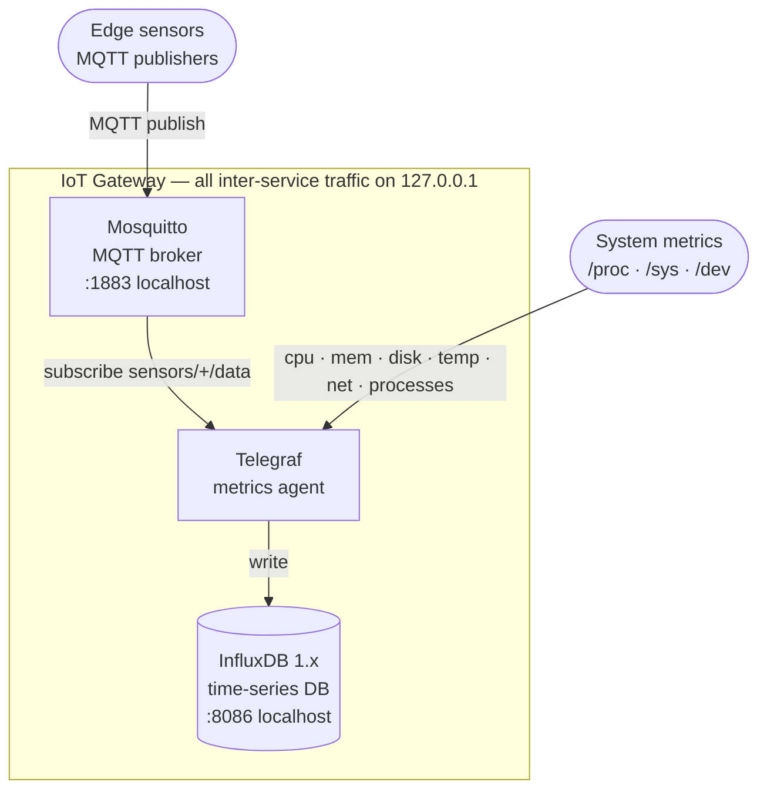
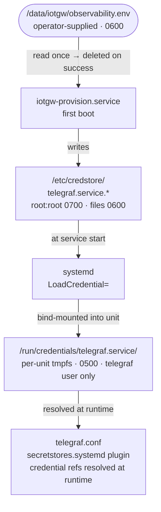

# Observability Stack

The IoT Gateway OS includes a native observability stack built from open-source components.
All three services run on-device — no cloud dependency for telemetry collection.

## Architecture



All inter-service traffic is local (`127.0.0.1`). No port is exposed to external
interfaces by default.

## Components

| Component  | Version | Recipe |
|------------|---------|--------|
| Mosquitto  | 2.x     | `recipes-connectivity/mosquitto/mosquitto_%.bbappend` |
| Telegraf   | 1.31.0  | `recipes-observability/telegraf/telegraf_1.31.0.bb` |
| InfluxDB   | 1.x     | `recipes-observability/influxdb/influxdb_%.bbappend` |
| Stack meta | 1.0.0   | `recipes-observability/iotgw-observability-stack/` |

The meta package (`iotgw-observability-stack`) pulls all three in as runtime
dependencies and installs the default configuration and credential scaffolding.

## Enabling in an Image

Add to your image recipe:

```bitbake
IMAGE_INSTALL:append = " iotgw-observability-stack"
```

Or via `kas/local.yml`:

```yaml
local_conf_header:
  observability: |
    IMAGE_INSTALL:append = " iotgw-observability-stack"
```

## Startup Dependency Mode

Telegraf supports two build-time startup modes:

- default (`IOTGW_OBSERVABILITY_REQUIRE_NETWORK_ONLINE = "0"`):
  `network.target` ordering, no hard wait on `network-online.target`.
  Recommended for local broker/DB and robust boot on unstable links.
- strict (`IOTGW_OBSERVABILITY_REQUIRE_NETWORK_ONLINE = "1"`):
  install a Telegraf systemd drop-in that switches ordering to
  `network-online.target`. Use for remote broker/DB startup gating.

Set in `kas/local.yml`:

```yaml
local_conf_header:
  observability_netmode: |
    IOTGW_OBSERVABILITY_REQUIRE_NETWORK_ONLINE = "1"
```

Runtime override (no rebuild) on deployed gateway:

```sh
# Ephemeral (current boot only): use /run/systemd/system
install -d /run/systemd/system/telegraf.service.d
install -d /run/systemd/system/mosquitto.service.d
install -d /run/systemd/system/influxdb.service.d

ln -snf /usr/share/iotgw-observability/netmode/telegraf-online.conf \
  /run/systemd/system/telegraf.service.d/99-runtime-netmode.conf
ln -snf /usr/share/iotgw-observability/netmode/mosquitto-online.conf \
  /run/systemd/system/mosquitto.service.d/99-runtime-netmode.conf
ln -snf /usr/share/iotgw-observability/netmode/influxdb-online.conf \
  /run/systemd/system/influxdb.service.d/99-runtime-netmode.conf

systemctl daemon-reload
systemctl restart mosquitto.service influxdb.service telegraf.service
```

Persistent override on RO-rootfs images (survives reboot/OTA): place the same
links in overlay upper:

```sh
install -d /data/overlays/etc/upper/systemd/system/telegraf.service.d
install -d /data/overlays/etc/upper/systemd/system/mosquitto.service.d
install -d /data/overlays/etc/upper/systemd/system/influxdb.service.d

ln -snf /usr/share/iotgw-observability/netmode/telegraf-online.conf \
  /data/overlays/etc/upper/systemd/system/telegraf.service.d/99-runtime-netmode.conf
ln -snf /usr/share/iotgw-observability/netmode/mosquitto-online.conf \
  /data/overlays/etc/upper/systemd/system/mosquitto.service.d/99-runtime-netmode.conf
ln -snf /usr/share/iotgw-observability/netmode/influxdb-online.conf \
  /data/overlays/etc/upper/systemd/system/influxdb.service.d/99-runtime-netmode.conf

systemctl daemon-reload
systemctl restart mosquitto.service influxdb.service telegraf.service
```

Revert to local-first mode:

```sh
rm -f /run/systemd/system/telegraf.service.d/99-runtime-netmode.conf
rm -f /run/systemd/system/mosquitto.service.d/99-runtime-netmode.conf
rm -f /run/systemd/system/influxdb.service.d/99-runtime-netmode.conf
rm -f /data/overlays/etc/upper/systemd/system/telegraf.service.d/99-runtime-netmode.conf
rm -f /data/overlays/etc/upper/systemd/system/mosquitto.service.d/99-runtime-netmode.conf
rm -f /data/overlays/etc/upper/systemd/system/influxdb.service.d/99-runtime-netmode.conf
systemctl daemon-reload
systemctl restart mosquitto.service influxdb.service telegraf.service
```

OTA behavior: these runtime drop-ins are marked `preserve` in overlay
reconciliation, so operator-selected mode survives slot switches.

## Credential Flow

Secrets (MQTT and InfluxDB passwords) are never stored in the Telegraf config,
environment variables, or process arguments. The flow is:



The bootstrap file `/data/iotgw/observability.env` is **deleted** by
`iotgw-provision` after credentials are successfully applied. If credential
application is incomplete, the file is retained for operator recovery.

### Bootstrap File Format

Create `/data/iotgw/observability.env` before first boot:

```sh
MQTT_USERNAME=telegraf
MQTT_PASSWORD=<strong-password>
INFLUXDB_USERNAME=telegraf
INFLUXDB_PASSWORD=<strong-password>
```

Permissions: `0600`, owned by `root`. The file is read once and consumed.

### Non-Secret Configuration

Non-secret defaults (InfluxDB URL, database name) ship in the image at
`/etc/default/iotgw-observability` and are managed by the RAUC overlay
reconciler (`replace_if_unmodified` policy — local edits are preserved across
OTA updates).

To override before build:

```bitbake
# In kas/local.yml local_conf_header or a bbappend:
INFLUXDB_URL = "http://127.0.0.1:8086"
INFLUXDB_DATABASE = "gateway_data"
```

To override on a running device (survives OTA as long as the file is modified):

```sh
# on target
mount -o remount,rw /etc   # or write to overlay upper directly
vi /etc/default/iotgw-observability
```

## Telegraf Inputs

| Plugin | Source | Notes |
|--------|--------|-------|
| `inputs.cpu` | `/proc/stat` | per-core + total |
| `inputs.mem` | `/proc/meminfo` | |
| `inputs.disk` | `statfs` | excludes tmpfs/overlay/squashfs |
| `inputs.system` | `/proc/loadavg` | load average, uptime |
| `inputs.temp` | `/sys/class/thermal` | SoC temperature |
| `inputs.processes` | `/proc` | process state counts |
| `inputs.net` | `/proc/net/dev` | `eth*`, `wlan*` interfaces |
| `inputs.mqtt_consumer` | Mosquitto broker | `sensors/+/data` topic, JSON |
| `inputs.modbus` | disabled | stanzas provided as commented examples |
| `inputs.internal` | Telegraf self | agent metrics |

### Adding Modbus Devices

Modbus TCP and RTU examples are included as commented stanzas in
`/etc/telegraf/telegraf.conf`. Uncomment and fill in device-specific
addressing. For Modbus RTU over RS485:

```toml
[[inputs.modbus]]
  name = "rs485_sensor"
  slave_id = 1
  timeout = "2s"
  controller = "file:///dev/ttyUSB0"
  baud_rate = 9600
  ...
```

> **Note:** If RS485/Modbus RTU is enabled, remove `PrivateDevices=yes` from
> `telegraf.service` or add an explicit `DeviceAllow=` for `/dev/ttyUSB*`.
> See comment in the service unit.

## Mosquitto ACL

Telegraf's MQTT user is granted read access to the sensor topic namespace:

```
user telegraf
topic read sensors/+/data
```

The ACL file is managed by `iotgw-provision` and enforced at runtime via the
RAUC overlay reconciler (`enforce_meta` policy, `mosquitto:mosquitto 0600`).

## Service Hardening

All three services run with systemd security sandboxing:

| Setting | mosquitto | telegraf | influxdb |
|---------|-----------|----------|---------|
| `User=` | `mosquitto` | `telegraf` | `influxdb` |
| `NoNewPrivileges` | yes | yes | yes |
| `PrivateTmp` | yes | yes | yes |
| `ProtectSystem` | — | strict | — |
| `CapabilityBoundingSet` | `CAP_NET_BIND_SERVICE` | _(empty)_ | — |
| `RestrictAddressFamilies` | — | `AF_UNIX AF_NETLINK AF_INET AF_INET6` | — |
| `StartLimitIntervalSec` | 0 (retry forever) | 5m (burst-limited) | 0 (retry forever) |
| `StartLimitBurst` | — | 3 | — |
| `RestartSec` | 5s | 30s | 10s |

For Telegraf, startup is gated by systemd `ExecCondition` checks that require
non-empty credential files under `/etc/credstore/`. This prevents crash loops
before provisioning has applied credentials.

Telegraf network dependency mode is controlled by
`IOTGW_OBSERVABILITY_REQUIRE_NETWORK_ONLINE` (see "Startup Dependency Mode").

## OTA Behaviour

The RAUC overlay reconciler handles these paths across A/B slot switches:

| Path | Policy | Behaviour |
|------|--------|-----------|
| `/etc/default/iotgw-observability` | `replace_if_unmodified` | updated by OTA if unchanged, preserved if edited locally |
| `/etc/telegraf/telegraf.conf` | `replace_if_unmodified` | same |
| `/etc/influxdb/influxdb.conf` | `replace_if_unmodified` | same |
| `/etc/mosquitto/passwd` | `enforce_meta` | ownership/mode enforced; content preserved |
| `/etc/mosquitto/acl` | `enforce_meta` | ownership/mode enforced; content preserved |

Credentials in `/etc/credstore/` are **not** managed by the reconciler — they
are written once by `iotgw-provision` and persist in the overlayfs upper layer.

## Querying Data

InfluxDB 1.x API/CLI requires authentication. Reuse the provisioned Telegraf
credentials for interactive checks:

```sh
INFLUX_USER="$(cat /etc/credstore/telegraf.service.influxdb_username)"
INFLUX_PASS="$(cat /etc/credstore/telegraf.service.influxdb_password)"
```

InfluxDB 1.x HTTP API (from the gateway itself or over SSH tunnel):

```sh
# List measurements
curl -sG 'http://localhost:8086/query' \
  --data-urlencode "db=gateway_data" \
  --data-urlencode "u=${INFLUX_USER}" \
  --data-urlencode "p=${INFLUX_PASS}" \
  --data-urlencode "q=SHOW MEASUREMENTS"

# Last 5 minutes of CPU usage
curl -sG 'http://localhost:8086/query' \
  --data-urlencode "db=gateway_data" \
  --data-urlencode "u=${INFLUX_USER}" \
  --data-urlencode "p=${INFLUX_PASS}" \
  --data-urlencode "q=SELECT mean(usage_system) FROM cpu WHERE time > now()-5m GROUP BY time(1m)"
```

InfluxDB CLI (on target):

```sh
influx -username "${INFLUX_USER}" -password "${INFLUX_PASS}" -database gateway_data
> SHOW MEASUREMENTS
> SELECT * FROM cpu ORDER BY time DESC LIMIT 5
```

## Upgrading to InfluxDB 3 (Native)

An experimental `influxdb3-bin` recipe is provided. To switch:

```bitbake
IOTGW_OBSERVABILITY_ENABLE_INFLUXDB3_NATIVE = "1"
```

This pulls in `influxdb3-bin` instead of the 1.x package. The Telegraf output
plugin and query API differ — update `outputs.influxdb` → `outputs.influxdb_v2`
in `telegraf.conf` and adjust the credential set accordingly.
