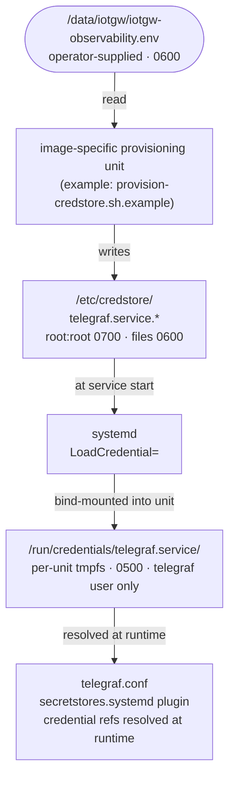

# Observability

## Current state (2026-06)

This layer ships two observability surfaces. The defaults reflect the
*current* operating posture, not the layer's full capability:

| Surface | Scope | Default | Notes |
|---------|-------|---------|-------|
| `edge-healthd` | Local unit/mount health, journald-published telemetry | **enabled** in all image variants via `packagegroup-iot-gw-apps`'s `-monitoring` slice | Recipe at `meta-iot-gateway/recipes-support/edge-healthd/`. Monitored set is configured in `files/healthd.conf` (currently `sshd.socket`, `systemd-networkd.service`, `mosquitto.service`, `systemd-journald.service`). |
| **Telegraf + InfluxDB stack** (this document) | Host metrics, MQTT consumer, time-series storage, dashboard-ready | **opt-in**, not in any image variant | Recipes last validated on scarthgap (`recipes-observability/telegraf/`, `recipes-observability/influxdb/`, `recipes-observability/influxdb3-bin/`); revalidate on wrynose when reinstating. See [Reinstatement](#reinstatement) below. |

`edge-healthd` covers the "is anything broken right now" question for the
field. The Telegraf+InfluxDB stack is for richer telemetry — historical
metrics, dashboards, future agentd / fleet-aggregation use cases — and is
the scope of the rest of this document.

## Engineering rationale

Why Telegraf is packaged natively in this layer instead of as a sidecar
container or pulled from an upstream OE layer:

- **No usable upstream OE recipe.** The OE layer index carries Telegraf in
  four layers (`meta-luneos`, `meta-webosose`, `meta-ossystems-base`,
  `meta-influx`); none go above 1.21.4. Telegraf 1.31 changed plugin
  registration to per-plugin files gated by `//go:build !custom ||
  <category>.<plugin>`, so the older recipe structures don't just need a
  version bump — they need a different build model entirely.
- **Minimal plugin set, not the 300+ default.** With the 1.31 build-constraint
  scheme, `telegraf custom_builder --dry-run --config telegraf.conf` from
  the upstream tree emits the exact `-tags` list the configured plugins
  need. The recipe pins that list as `TELEGRAF_PLUGIN_TAGS`. This both
  produces a much smaller binary and sidesteps a Go-linker duplicate-symbol
  error (`__cgoenqueue` defined in both `azure-kusto-go` and `gosnowflake`
  via shared antlr4/cel-go generated C code) that fires the moment all
  plugins are pulled in.
- **Pure-Go build matches upstream's release flags.** `CGO_ENABLED=0`,
  `GOBUILDFLAGS:remove = "-buildmode=pie"`, `GO_LINKSHARED=""`. Mixing
  PIE + CGO under `go.bbclass`'s defaults trips a separate duplicate-symbol
  failure from a different package pair in the same generated-code tree.
  The symptom keeps surfacing from different package combinations until
  the flags match upstream's pure-Go release build.
- **Credentials never in the rootfs or the environment.** Squashfs is
  replaced wholesale on RAUC OTA, so anything baked into the image is
  either shared fleet-wide or wiped on upgrade. `EnvironmentFile=` exposes
  secrets in `/proc/$PID/environ` and core dumps; `Environment=` in a unit
  drop-in serialises into `/run/systemd/` and is visible via
  `systemctl show`. The stack uses systemd `LoadCredential=` (250+) plus
  Telegraf's `secretstores.systemd` plugin so secrets exist only as files
  in a per-unit tmpfs at `$CREDENTIALS_DIRECTORY`, mode 0500/0400, owned
  by the service user — not in env, not in argv, not in `/proc`. The
  persistent backing for those credentials lives on the ext4 `/data`
  partition (overlay upper for `/etc`), which OTA does not touch.
- **Network-online gating is a deliberate choice, not a default.** The
  recipe defaults to local-first ordering (`After=network.target`,
  `Wants=mosquitto.service`) because telegraf, mosquitto and influxdb
  all live on `127.0.0.1` in the standard topology. Remote broker / DB
  deployments need the network-online drop-in; see
  [Reinstatement → network-online decision](#network-online-decision).

## Architecture

When the stack is installed, all inter-service traffic stays on
`127.0.0.1`. No port is exposed to external interfaces by default.


## Components

| Component  | Version | Recipe |
|------------|---------|--------|
| Mosquitto  | 2.x     | `recipes-connectivity/mosquitto/mosquitto_%.bbappend` (already in all image variants) |
| Telegraf   | 1.31.0  | `recipes-observability/telegraf/telegraf_1.31.0.bb` |
| InfluxDB 1 | 1.x     | `recipes-observability/influxdb/influxdb_%.bbappend` |
| InfluxDB 3 | 3.0.0   | `recipes-observability/influxdb3-bin/influxdb3-bin_3.0.0.bb` (experimental, see [Upgrading to InfluxDB 3](#upgrading-to-influxdb-3-native)) |

**Persistence.** Mosquitto (in all image variants) keeps retained
messages/sessions at `/data/mosquitto` (`persistence_location`), so they survive
reboot and RAUC A/B updates. When the optional InfluxDB 3 recipe is installed,
its data directory persists at `/data/influxdb3` (`INFLUXDB3_DATA_DIR`). The
larger Telegraf/InfluxDB stack remains opt-in and is not in any image variant.
See [Persistent State Architecture](PERSISTENT_STATE.md).

There is no meta-package; reinstatement is done by adding the desired
components directly to `IMAGE_INSTALL`. The previous
`iotgw-observability-stack` meta-recipe was retired together with the
in-tree image install in PR #90 — its credential scaffolding moved into
the Telegraf recipe itself, so the binary recipe is now self-sufficient
for the parts that are Telegraf-specific.

## Reinstatement

### 1. Add to an image

Either in a custom image recipe:

```bitbake
IMAGE_INSTALL:append = " telegraf influxdb"
```

…or in `kas/local.yml`:

```yaml
local_conf_header:
  observability: |
    IMAGE_INSTALL:append = " telegraf influxdb"
```

This pulls in:

- The Telegraf binary, its `telegraf.conf`, the hardened
  `telegraf.service`, the tmpfiles entry, and **the credential
  scaffolding**: `/etc/credstore/` (mode 0700, root:root) with four
  zero-byte placeholders (mode 0600, root:root) for
  `telegraf.service.{mqtt,influxdb}_{username,password}`, plus
  `/etc/default/iotgw-observability` carrying empty `INFLUXDB_URL` /
  `INFLUXDB_DATABASE` defaults for the integrator to fill.
- InfluxDB 1.x (or InfluxDB 3 via the experimental recipe — see below).
- Mosquitto is already in every image variant; no extra action.

### 2. Wire first-boot credential population

The Telegraf recipe ships a worked example at
`/usr/share/iotgw-observability/provision-credstore.sh.example` that
reads MQTT and InfluxDB credentials from
`/data/iotgw/iotgw-observability.env` and populates the four credstore
files via an idempotent `set_credential_value` helper. Integrate it into
your image's first-boot provisioning service (the layer's
`iotgw-provision.service` is one place; an image-specific service is
another).

Bootstrap file format — write this to `/data/iotgw/iotgw-observability.env`
on the device before first boot (mode 0600, root:root):

```sh
MQTT_USERNAME=telegraf
MQTT_PASSWORD=<strong-password>
INFLUXDB_USERNAME=telegraf
INFLUXDB_PASSWORD=<strong-password>
```

The example script does **not** delete this file after success; that's a
rotation-policy decision left to the integrator. A consume-and-delete
pattern (shred on success) reduces on-disk secret exposure but loses
recovery if a later reprovision is needed before the next manufacturing
event — pick per fleet policy.

Until non-empty values land in all four credstore files, telegraf.service
remains in `condition-failed` state thanks to the four
`ConditionFileNotEmpty=` directives in `[Unit]`. This is the intended
behaviour — no restart loop, no journal noise, clean recovery on the
next start attempt once provisioning completes.

### 3. Non-secret config

`INFLUXDB_URL` and `INFLUXDB_DATABASE` ship empty so a misconfigured
image fails loudly rather than silently writing to a wrong endpoint.
Set them either at build time (kas overlay / local.conf bbappend) or
at runtime by editing `/etc/default/iotgw-observability` (overlay upper
is on `/data`, so edits survive OTA when the file is modified — see
[OTA behaviour](#ota-behaviour)).

### Network-online decision

The recipe defaults to **local-first** ordering, matching the
standard `127.0.0.1` topology where telegraf, mosquitto and influxdb
all listen locally:

```
TELEGRAF_REQUIRE_NETWORK_ONLINE ?= "0"
```

Flip to `"1"` in a bbappend or `kas/local.yml` to install a systemd
drop-in (`/etc/systemd/system/telegraf.service.d/10-network-online.conf`)
that switches ordering to `network-online.target mosquitto.service`.
Recommended only when telegraf's outputs.* or inputs.mqtt_consumer talks
to **remote** endpoints whose DNS / routing isn't ready at
`network.target` — the local-broker / local-DB case does not benefit.

```yaml
# kas/local.yml
local_conf_header:
  observability_netmode: |
    TELEGRAF_REQUIRE_NETWORK_ONLINE = "1"
```

There is no runtime override surface in the layer — the previous
`/usr/share/iotgw-observability/netmode/*-online.conf` drop-ins shipped
by the deleted `iotgw-observability-stack` recipe are gone. An operator
who needs runtime mode switching can hand-write a drop-in under
`/run/systemd/system/telegraf.service.d/` (ephemeral) or in the `/data`
overlay upper (persistent across OTA via the reconciler).

## Credential flow



Credential references in `telegraf.conf`:

```toml
[[secretstores.systemd]]
  id = "systemd"
  prefix = ""

[[outputs.influxdb]]
  urls = ["${INFLUXDB_URL}"]
  database = "${INFLUXDB_DATABASE}"
  username = "@{systemd:influxdb_username}"
  password = "@{systemd:influxdb_password}"

[[inputs.mqtt_consumer]]
  servers = ["tcp://localhost:1883"]
  username = "@{systemd:mqtt_username}"
  password = "@{systemd:mqtt_password}"
  topics = ["sensors/+/data"]
  data_format = "json"
```

The `@{systemd:key}` references resolve at runtime from
`$CREDENTIALS_DIRECTORY`. `INFLUXDB_URL` and `INFLUXDB_DATABASE` come
from the non-secret env file via `EnvironmentFile=-/etc/default/iotgw-observability`.

## Telegraf inputs

The shipped `telegraf.conf` enables the following inputs, matching the
`TELEGRAF_PLUGIN_TAGS` set in the recipe:

| Plugin | Source | Notes |
|--------|--------|-------|
| `inputs.cpu` | `/proc/stat` | per-core + total |
| `inputs.mem` | `/proc/meminfo` | |
| `inputs.disk` | `statfs` | excludes tmpfs/overlay/squashfs |
| `inputs.system` | `/proc/loadavg` | load average, uptime |
| `inputs.temp` | `/sys/class/thermal` | SoC temperature |
| `inputs.processes` | `/proc` | process state counts |
| `inputs.net` | `/proc/net/dev` | `eth*`, `wlan*` interfaces |
| `inputs.mqtt_consumer` | Mosquitto broker | `sensors/+/data` topic, JSON |
| `inputs.modbus` | disabled | stanzas provided as commented examples |
| `inputs.internal` | Telegraf self | agent metrics |

Adding a plugin requires both a config stanza and a tag in
`TELEGRAF_PLUGIN_TAGS` — re-derive the full tag set with
`telegraf custom_builder --dry-run --config telegraf.conf` from the
upstream tree. Don't guess.

### Adding Modbus devices

Modbus TCP and RTU examples are included as commented stanzas in
`/etc/telegraf/telegraf.conf`. Uncomment and fill in device-specific
addressing. For Modbus RTU over RS485:

```toml
[[inputs.modbus]]
  name = "rs485_sensor"
  slave_id = 1
  timeout = "2s"
  controller = "file:///dev/ttyUSB0"
  baud_rate = 9600
  ...
```

> **Note:** If RS485/Modbus RTU is enabled, remove `PrivateDevices=yes`
> from `telegraf.service` or add an explicit `DeviceAllow=` for
> `/dev/ttyUSB*`. See the comment in the unit.

## Mosquitto ACL

Telegraf's MQTT user is granted read access to the sensor topic namespace:

```
user telegraf
topic read sensors/+/data
```

The ACL file is managed at first boot by `iotgw-provision` (the
mosquitto-broker side of provisioning was retained in PR #90) and enforced
at runtime via the RAUC overlay reconciler (`enforce_meta` policy,
`mosquitto:mosquitto 0600`).

## Service hardening

When the stack is installed, all three services run with systemd security
sandboxing:

| Setting | mosquitto | telegraf | influxdb |
|---------|-----------|----------|---------|
| `User=` | `mosquitto` | `telegraf` | `influxdb` |
| `NoNewPrivileges` | yes | yes | yes |
| `PrivateTmp` | yes | yes | yes |
| `ProtectSystem` | — | strict | — |
| `CapabilityBoundingSet` | `CAP_NET_BIND_SERVICE` | _(empty)_ | — |
| `RestrictAddressFamilies` | — | `AF_UNIX AF_NETLINK AF_INET AF_INET6` | — |
| `StartLimitIntervalSec` | 0 (retry forever) | 5m (burst-limited) | 0 (retry forever) |
| `StartLimitBurst` | — | 3 | — |
| `RestartSec` | 5s | 30s | 10s |

Telegraf startup is gated by four `ConditionFileNotEmpty=` directives in
`[Unit]` that require non-empty credstore files. This prevents crash
loops before provisioning has applied credentials.

## OTA behaviour

If the stack is installed, the RAUC overlay reconciler handles these paths
across A/B slot switches:

| Path | Policy | Behaviour |
|------|--------|-----------|
| `/etc/default/iotgw-observability` | `replace_if_unmodified` | updated by OTA if unchanged, preserved if edited locally |
| `/etc/telegraf/telegraf.conf` | `replace_if_unmodified` | same |
| `/etc/influxdb/influxdb.conf` | `replace_if_unmodified` | same |
| `/etc/mosquitto/passwd` | `enforce_meta` | ownership/mode enforced; content preserved |
| `/etc/mosquitto/acl` | `enforce_meta` | ownership/mode enforced; content preserved |

Credentials in `/etc/credstore/` are **not** managed by the reconciler —
they are populated once by the image's provisioning unit and persist in
the overlayfs upper layer on `/data`.

## Querying data

InfluxDB 1.x API/CLI requires authentication. Reuse the provisioned
Telegraf credentials for interactive checks:

```sh
INFLUX_USER="$(cat /etc/credstore/telegraf.service.influxdb_username)"
INFLUX_PASS="$(cat /etc/credstore/telegraf.service.influxdb_password)"
```

InfluxDB 1.x HTTP API (from the gateway itself or over SSH tunnel):

```sh
# List measurements
curl -sG 'http://localhost:8086/query' \
  --data-urlencode "db=gateway_data" \
  --data-urlencode "u=${INFLUX_USER}" \
  --data-urlencode "p=${INFLUX_PASS}" \
  --data-urlencode "q=SHOW MEASUREMENTS"

# Last 5 minutes of CPU usage
curl -sG 'http://localhost:8086/query' \
  --data-urlencode "db=gateway_data" \
  --data-urlencode "u=${INFLUX_USER}" \
  --data-urlencode "p=${INFLUX_PASS}" \
  --data-urlencode "q=SELECT mean(usage_system) FROM cpu WHERE time > now()-5m GROUP BY time(1m)"
```

InfluxDB CLI (on target):

```sh
influx -username "${INFLUX_USER}" -password "${INFLUX_PASS}" -database gateway_data
> SHOW MEASUREMENTS
> SELECT * FROM cpu ORDER BY time DESC LIMIT 5
```

## Upgrading to InfluxDB 3 (Native)

An experimental `influxdb3-bin` recipe ships in
`recipes-observability/influxdb3-bin/`. To switch the reinstated stack
from InfluxDB 1.x to InfluxDB 3 Core, add `influxdb3-bin` to
`IMAGE_INSTALL` in place of `influxdb`. The Telegraf output plugin and
query API differ — update `outputs.influxdb` → `outputs.influxdb_v2` in
`telegraf.conf` and adjust the credential set accordingly.

The `INFLUXDB3_BIN_SRC_URI` variable must be set to point at the
prebuilt archive; see the recipe header for details.
