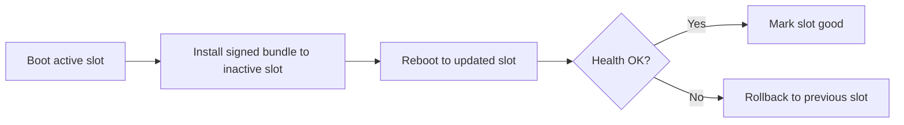
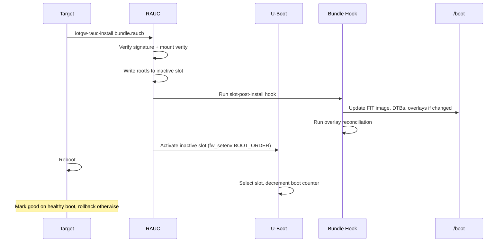

<div align="center">

# 🔄 RAUC Over-The-Air Updates

**Architecture and design reference for RAUC A/B rootfs updates**

[](https://rauc.io/)
[](https://www.kernel.org/doc/html/latest/admin-guide/device-mapper/verity.html)
[](https://www.denx.de/wiki/U-Boot)

</div>

---

## 📖 Overview

The IoT Gateway uses RAUC with an A/B partition layout for atomic,
rollback-capable system updates. Updates are delivered as signed bundles
containing a rootfs image and boot assets (kernel, DTBs, U-Boot).

For on-target operations, preflight, and troubleshooting runbooks, see
[RAUC Update Runbook](RAUC_UPDATE.md).

### Update Flow



### System Architecture

| Component | Type | Purpose |
|-----------|------|---------|
| **Root Filesystem** | A/B (dual ext4) | Only one active at boot |
| **/boot Partition** | Shared FAT | FIT images, DTBs, U-Boot, config.txt |
| **Bundle Format** | dm-verity | Signed, integrity-protected, optionally encrypted |
| **Bootloader** | U-Boot | Env-based slot selection with bootcount rollback |

---

## 🔄 Installation Sequence



### Key Properties

✅ **Synchronized Update Path** — Bundle hook updates `/boot` in the same install transaction
✅ **Per-Slot FIT Naming** — Each slot writes its own kernel (`fitImage-a` / `fitImage-b`) on the shared boot partition
✅ **Overlay Reconciliation** — Post-install hook manages `/etc` overlay entries according to policy

---

## 🔙 Rollback Behavior

RAUC's bootchooser provides automatic failsafe via U-Boot bootcount:

| Scenario | Behavior |
|----------|----------|
| **Boot Success** | `rauc-mark-good` marks slot, becomes default |
| **Boot Failure** | Bootcount exhausted → U-Boot falls back to previous slot |
| **Explicit Rollback** | `rauc mark-active other && reboot` |

### ⚠️ Important

> The `/boot` partition is **not A/B**. Kernel and DTB updates are applied in-place by the bundle hook. On rollback, the rootfs reverts but boot assets remain. This requires kernel ABI compatibility across releases.

---

## 🔐 Security

| Feature | Description |
|---------|-------------|
| **Bundle Signing** | Cryptographic signatures verified on-device before installation |
| **Integrity Protection** | dm-verity format provides tamper detection |
| **Boot Integrity Chain** | U-Boot FIT signature verification + signed RAUC bundles |
| **Bundle Encryption** | Optional `crypt` format with per-device decryption key |
| **mTLS Streaming** | Device identity verified via client certificate |

---

## 🌐 HTTPS Streaming Updates (mTLS)

RAUC supports installing bundles directly over HTTPS without pre-downloading to local storage. This uses streaming mode (NBD + HTTP range requests) with mutual TLS authentication.

- 📡 **Native streaming**: `iotgw-rauc-install https://<server>:8443/bundles/<bundle>.raucb`
- 🏷️ **Device tracking** via RAUC headers (boot-id, machine-id, transaction-id)
- 🔑 **mTLS auth** using device certificates provisioned on the gateway

### 🔧 Device Configuration

The streaming client is configured in `/etc/rauc/system.conf`:

```ini
[streaming]
sandbox-user=ota
tls-cert=/etc/ota/device.crt
tls-key=/etc/ota/device.key
tls-ca=/etc/ota/ca.crt
send-headers=boot-id;machine-id;transaction-id
```

### 🔐 Certificates

Device certs are provisioned by `ota-certs-provision`:
- Production: `/boot/iotgw/ota/` or `/data/ota/certs/`
- Existing certs in `/etc/ota` are kept when still valid

Server cert must include a SAN matching the OTA server IP/hostname.

### 🆕 First Boot After Fresh Flash

After flashing a new SD card image, OTA certificate and TPM PKCS#11
state must be (re-)provisioned before streaming updates will work. This
is expected — the data partition is blank and `/etc/ota` contains only
build-time files (CA cert, `openssl-tpm2.cnf`, `updater.conf`).

**Provisioning steps:**

1. **Sync device certs** (from host):
   ```bash
   ./scripts/ota-certs-sync.sh
   ```
2. **Reboot** so the `/etc` overlay mounts cleanly with new files.
3. **Verify** cert chain on target:
   ```bash
   openssl verify -CAfile /etc/ota/ca.crt /etc/ota/device.crt
   ```
4. **(If TPM/PKCS#11 enabled)** Re-provision the TPM2 PKCS#11 token:
   ```bash
   ./scripts/ota-pkcs11-provision-check.sh
   ```

Until step 2 completes, `ota-certs-provision.service` will log a
degraded-mode warning — this is harmless and self-resolves after reboot.

---

## 🔑 TPM-Backed Client Key

`ota-update-check` can use a TPM-backed OpenSSL key URI instead of a filesystem
private key. Configure `/etc/ota/updater.conf`:

```json
{
  "device_cert": "/etc/ota/device.crt",
  "device_key_uri": "handle:0x81000001",
  "openssl_conf": "/etc/ota/openssl-tpm2.cnf",
  "ca_cert": "/etc/ota/ca.crt"
}
```

Notes:
- `device_key_uri` takes precedence over `device_key`.
- TPM mode is build-gated by `IOTGW_ENABLE_OTA_TPM_MTLS = "1"` (default `0`,
  preserving non-TPM file-key flow).
- Current curl builds use OpenSSL engine mode (`tpm2tss`) for TPM handles.
  Provider-based key support is deferred to future curl builds.
- With TPM mode enabled, `ota-updater.service` gets supplementary `iotgwtpm`
  group access for `/dev/tpmrm0`.

---

## ⚙️ Feature-Gating Profiles

All advanced OTA paths are opt-in. Default remains `verity + file-key`.

**Baseline (default)** — no additional variables required.
Verity bundle, file-key mTLS, no TPM.

**Updater TPM only** — `ota-updater` uses a TPM key URI for manifest
polling; RAUC streaming still uses the file key.
```
IOTGW_ENABLE_OTA_TPM_MTLS = "1"
IOTGW_OTA_TPM_KEY_URI     = "handle:0x81000001"
IOTGW_OTA_TPM_KEY_ENGINE  = "tpm2tss"
```

**RAUC PKCS#11 streaming** — RAUC streaming authenticates via a PKCS#11
token. Backend is `tpm2` (hardware-backed) or `custom` (software token).
```
IOTGW_RAUC_STREAMING_KEY_MODE = "pkcs11"
IOTGW_RAUC_PKCS11_BACKEND    = "tpm2"
IOTGW_RAUC_PKCS11_TLS_KEY    = "pkcs11:token=iotgw;object=rauc-client-key;type=private;pin-source=file:/etc/ota/pkcs11-pin"
```

**Encrypted bundles** — RAUC `crypt` format with per-device decryption
key. Independent of streaming key mode.
```
IOTGW_ENABLE_RAUC_BUNDLE_ENCRYPTION = "1"
IOTGW_RAUC_BUNDLE_ENCRYPT_RECIPIENTS = "/path/to/device-filekey.crt"
IOTGW_RAUC_ENCRYPTION_KEY            = "/etc/ota/device.key"
```

**Full TPM + PKCS#11 + crypt** — combines all three. Set all variables
from the profiles above.

> 💡 **Compatibility notes:**
> - PKCS#11 streaming and encrypted bundle decryption are independent.
> - To return to baseline: set `IOTGW_ENABLE_OTA_TPM_MTLS = "0"`,
>   `IOTGW_RAUC_STREAMING_KEY_MODE = "file"`, and
>   `IOTGW_ENABLE_RAUC_BUNDLE_ENCRYPTION = "0"`.

### 🔒 PKCS#11 PIN Handling

- Prefer `pin-source=file:/etc/ota/pkcs11-pin` over inline `pin-value`.
- Keep `/etc/ota/pkcs11-pin` permission-restricted (`root:ota 0640`).
- For TPM2 backend, keep `module-path` out of URI when `PKCS11_MODULE_PATH` is
  provided via `rauc.service` environment.

---

## ⚠️ Design Considerations

**Shared /boot partition** — kernel and DTB updates are applied in-place
by the bundle hook. On rollback, the rootfs reverts but boot assets
remain. Maintain kernel ABI compatibility across releases.

**Overlay reconciliation** — OTA updates trigger the overlay reconciler
which manages `/etc` overlay entries according to policy (`enforce`,
`replace_if_unmodified`, `preserve`, `absent`). See
[Overlay Reconciliation](OVERLAY_RECONCILIATION.md).

**Future: transactional boot updates** — stage boot assets in rootfs,
copy to `/boot` only after successful boot and health check, enabling
fully atomic kernel updates.

---

## 📚 References

- [RAUC Update Runbook](RAUC_UPDATE.md) — on-target operations and troubleshooting
- [U-Boot Hardening](UBOOT_HARDENING.md) — bootloader hardening and env-based slot selection
- [Partition Layouts](PARTITIONS.md) — A/B partition sizing
- [Overlay Reconciliation](OVERLAY_RECONCILIATION.md) — post-OTA config management
- [RAUC Documentation](https://rauc.readthedocs.io/)
- [dm-verity](https://www.kernel.org/doc/html/latest/admin-guide/device-mapper/verity.html)
