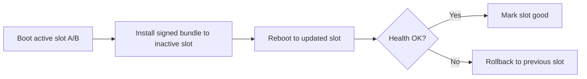
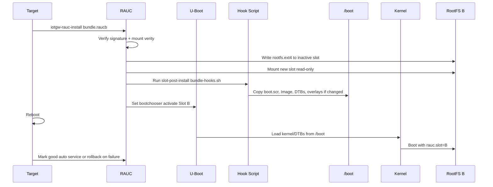

<div align="center">

# 🔄 RAUC Over-The-Air Updates

**Guide to RAUC A/B rootfs updates and slot rollback behavior**

[](https://rauc.io/)
[](https://www.kernel.org/doc/html/latest/admin-guide/device-mapper/verity.html)
[](https://www.denx.de/wiki/U-Boot)

</div>

---

## 📖 Overview

This guide covers the OTA update workflow used in this repository on Raspberry Pi 5, including:
- 🔀 **A/B Rootfs Updates** — Dual-partition update system
- 🥾 **Boot Asset Updates** — Kernel, DTBs, and U-Boot via bundle hooks
- 🔙 **Slot Rollback** — Bootchooser-based fallback behavior
- 🔐 **Signed Bundles** — Cryptographic verification with dm-verity

Use this document for architecture and release flow.  
For on-target operations, preflight, and troubleshooting runbooks, use [RAUC Update Runbook](RAUC_UPDATE.md).

### Update Flow



### System Architecture

| Component | Type | Purpose |
|-----------|------|---------|
| **Root Filesystem** | A/B (dual ext4) | Only one active at boot |
| **/boot Partition** | Shared FAT | Firmware, U-Boot, kernel, DTBs |
| **Bundle Format** | dm-verity | Signed, integrity-protected |

---

## 📦 Bundle Contents

RAUC bundles can carry the artifacts needed for a rootfs + boot-asset update flow:

| File | Description |
|------|-------------|
| `*.rootfs.ext4` | 🗂️ Root filesystem image for inactive slot |
| `bootfiles.tar.gz` | 🥾 Boot assets (kernel, DTBs, U-Boot) |
| `bundle-hooks.sh` | 🪝 Post-install hook script |

### Boot Files Archive

The `bootfiles.tar.gz` includes:
- `boot.scr` — U-Boot boot script
- `u-boot.bin` — U-Boot bootloader
- `Image` — Linux kernel
- `kernel_2712.img` — Raspberry Pi 5 kernel
- `bcm2712-rpi-5-b.dtb` — Device Tree Blob
- `overlays/` — Device Tree overlays
- `splash.bmp` — Boot splash screen (optional)

---

## 🔄 Installation Sequence



### Key Properties

✅ **Synchronized Update Path** — Bundle hook updates `/boot` in the same install transaction
✅ **Ordered Installation** — Hook runs after rootfs write, before reboot
✅ **Read-only Verification** — New slot mounted read-only during update

---

## 🔙 Rollback Behavior

RAUC's bootchooser provides automatic failsafe:

| Scenario | Behavior |
|----------|----------|
| **Boot Success** | New slot marked good, becomes default |
| **Boot Failure** | Bootchooser fallback after configured retry budget |
| **Health Check Fail** | Manual or auto rollback via `rauc status` |

### Important Considerations

> ⚠️ **Shared /boot Partition**: Kernel/DTBs copied by the hook remain after rollback

**Design Implications:**
- Keep kernel ABI compatible across releases
- Test kernel updates thoroughly before deployment
- Advanced option: Stage bootfiles in rootfs, copy only after marking good

### Rollback Commands

```bash
# Mark current slot as bad (triggers rollback on next boot)
rauc mark-bad booted
reboot

# Or mark the other slot as active
rauc mark-active other
reboot
```

---

## 🛠️ Building Bundles

### Bundle Types

| Bundle Type | Target | Updates | Output File |
|-------------|--------|---------|-------------|
| **Rootfs Only** | Faster updates | Rootfs only | `iot-gw-bundle.raucb` |
| **Full System** | Rootfs + boot assets | Rootfs + Kernel + DTBs | `iot-gw-bundle-full.raucb` |

#### Build Commands

<table>
<tr><th>Rootfs Only</th><th>Rootfs + Kernel</th></tr>
<tr>
<td>

```bash
# Development
make bundle-dev

# Standard
make bundle

# Production
make bundle-prod
```

</td>
<td>

```bash
# Development
make bundle-dev-full

# Standard
make bundle-full

# Production
make bundle-prod-full
```

</td>
</tr>
</table>

> 💡 **Note**: Bundle filename is based on the recipe name, not the image variant. Makefile handles variant selection via `BUNDLE_IMAGE_NAME`.

---

## ✅ Verification & Deployment

### 1. Verify Bundle (Optional)

```bash
# Verify signature and contents
oe-run-native rauc-native rauc info \
  --keyring meta-iot-gateway/recipes-ota/rauc/files/dev-cert.pem \
  build/tmp/deploy/images/raspberrypi5/iot-gw-bundle-full.raucb
```

### 2. Deploy to Device

```bash
# Copy bundle to target
scp build/tmp/deploy/images/raspberrypi5/iot-gw-bundle-full.raucb \
  root@device:/tmp/

# Install (wrapper handles temporary /boot rw remount + restore to ro)
ssh root@device 'iotgw-rauc-install /tmp/iot-gw-bundle-full.raucb && reboot'
```

### 3. Verify Update

```bash
# Check RAUC status
rauc status --detailed

# Review installation logs
journalctl -u rauc -b | grep "\[bundle-hook\]"
```

---

## 📁 Implementation Files

| Component | Path |
|-----------|------|
| **Bundle Recipes** | `meta-iot-gateway/recipes-ota/bundles/*.bb` |
| **Common Config** | `meta-iot-gateway/recipes-ota/bundles/iot-gw-bundle-common.inc` |
| **Hook Script** | `meta-iot-gateway/recipes-ota/rauc/files/bundle-hooks.sh` |
| **Bootfiles Archive** | `meta-iot-gateway/recipes-bsp/bootimage/rpi-bootfiles-archive.bb` |
| **RAUC Config** | `meta-iot-gateway/recipes-ota/rauc/rauc-conf.bb` |

---

## 🔐 Security

| Feature | Implementation |
|---------|----------------|
| **Bundle Signing** | Cryptographic signatures verified on-device |
| **Integrity Protection** | dm-verity format for tamper detection |
| **Boot Integrity Chain** | U-Boot FIT verification + signed RAUC bundles |

---

## 🌐 HTTPS Streaming Updates (mTLS)

RAUC supports installing bundles directly over HTTPS without pre-downloading to local storage. This uses streaming mode (NBD + HTTP range requests) with mutual TLS authentication.

### ✅ What This Enables

- **Native streaming install**: `iotgw-rauc-install https://<server>:8443/bundles/<bundle>.raucb`
- **Device tracking** via headers sent by RAUC (boot-id, machine-id, transaction-id)
- **mTLS auth** using device certificates provisioned on the gateway

### 🔧 Device Configuration

The streaming client is configured in `/etc/rauc/system.conf`:

```ini
[streaming]
sandbox-user=ota
tls-cert=/etc/ota/device.crt
tls-key=/etc/ota/device.key
tls-ca=/etc/ota/ca.crt
send-headers=boot-id;machine-id;transaction-id
```

### 🔐 Certificates

Device certs are provisioned by `ota-certs-provision`:
- Production: `/boot/iotgw/ota/` or `/data/ota/certs/`
- Existing certs in `/etc/ota` are kept when still valid

Server cert must include a SAN matching the OTA server IP/hostname.

### TPM-backed client key (OTA updater manifest polling)

`ota-update-check` can use a TPM-backed OpenSSL key URI instead of a filesystem
private key. Configure `/etc/ota/updater.conf`:

```json
{
  "device_cert": "/etc/ota/device.crt",
  "device_key_uri": "handle:0x81000001",
  "openssl_conf": "/etc/ota/openssl-tpm2.cnf",
  "ca_cert": "/etc/ota/ca.crt"
}
```

Notes:
- `device_key_uri` takes precedence over `device_key`.
- TPM mode is build-gated by `IOTGW_ENABLE_OTA_TPM_MTLS = "1"` (default `0`,
  preserving non-TPM file-key flow).
- On current gateway curl builds (`--key-type` supports `ENG`, not `PROV`), TPM
  handles are used via OpenSSL engine mode (`tpm2tss`) when
  `device_key_uri` is `handle:0x...`.
- `openssl_conf` remains optional for provider-based tooling and future curl
  builds with provider key support.
- With TPM mode enabled, `ota-updater.service` gets supplementary `iotgwtpm`
  group access for `/dev/tpmrm0`.

---

## ⚠️ Limitations & Considerations

### Current Design

| Aspect | Behavior |
|--------|----------|
| **/boot Partition** | ❌ Not A/B — updates applied in-place |
| **Kernel Updates** | Applied immediately via hook |
| **Rollback** | Rootfs rolls back, kernel/DTBs remain |

### Recommendations

- ✅ Maintain kernel ABI compatibility between releases
- ✅ Test kernel updates in development environment
- ⚠️ For fully failsafe boot: Consider GPT/MBR boot slot switching

### Advanced Option (Future)

Stage bootfiles in rootfs → Copy to `/boot` only after successful boot + health check → Fully transactional kernel updates

---

## 🔧 Troubleshooting

Common troubleshooting areas include:
- wrapper/systemd-run behavior
- fw_env and slot switching failures
- streaming TLS/CA consistency checks
- adaptive update alignment checks

---

## 📚 References

- [RAUC Documentation](https://rauc.readthedocs.io/)
- [U-Boot Bootchooser](https://rauc.readthedocs.io/en/latest/integration.html#u-boot)
- [dm-verity](https://www.kernel.org/doc/html/latest/admin-guide/device-mapper/verity.html)
