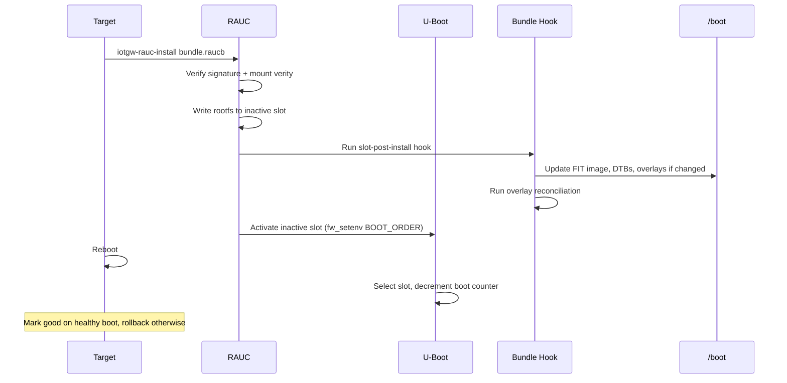

<div align="center">

# 🔄 RAUC Over-The-Air Updates

**Architecture and design reference for RAUC A/B rootfs updates**

[](https://rauc.io/)
[](https://www.kernel.org/doc/html/latest/admin-guide/device-mapper/verity.html)
[](https://www.denx.de/wiki/U-Boot)

</div>

---

## 📖 Overview

The IoT Gateway uses RAUC with an A/B partition layout for atomic,
rollback-capable system updates. Updates are delivered as signed bundles
containing a rootfs image and boot assets (kernel, DTBs, U-Boot).

For on-target operations, preflight, and troubleshooting runbooks, see
[RAUC Update Runbook](RAUC_UPDATE.md).

### Update Flow


```mermaid
graph LR
    A[Boot active slot] --> I[Install signed bundle to inactive slot]
    I --> R[Reboot to updated slot]
    R --> H{Health OK?}
    H -->|Yes| G[Mark slot good]
    H -->|No| RB[Rollback to previous slot]
```

### System Architecture

| Component | Type | Purpose |
|-----------|------|---------|
| **Root Filesystem** | A/B (dual ext4) | Only one active at boot |
| **/boot Partition** | Shared FAT | FIT images, DTBs, U-Boot, config.txt |
| **Bundle Format** | dm-verity | Signed, integrity-protected, optionally encrypted |
| **Bootloader** | U-Boot | Env-based slot selection with bootcount rollback |

---

## 🔄 Installation Sequence


```mermaid
sequenceDiagram
    participant T as Target
    participant R as RAUC
    participant U as U-Boot
    participant Hook as Bundle Hook
    participant Boot as /boot

    T->>R: iotgw-rauc-install bundle.raucb
    R->>R: Verify signature + mount verity
    R->>R: Write rootfs to inactive slot
    R->>Hook: Run slot-post-install hook
    Hook->>Boot: Update FIT image, DTBs, overlays if changed
    Hook->>Hook: Run overlay reconciliation
    R->>U: Activate inactive slot (fw_setenv BOOT_ORDER)
    T->>T: Reboot
    U->>U: Select slot, decrement boot counter
    Note over T: Mark good on healthy boot, rollback otherwise
```

### Key Properties

✅ **Synchronized Update Path** — Bundle hook updates `/boot` in the same install transaction
✅ **Per-Slot FIT Naming** — Each slot writes its own kernel (`fitImage-a` / `fitImage-b`) on the shared boot partition
✅ **Overlay Reconciliation** — Post-install hook manages `/etc` overlay entries according to policy

---

## 🔙 Rollback Behavior

RAUC's bootchooser provides automatic failsafe via U-Boot bootcount:

| Scenario | Behavior |
|----------|----------|
| **Boot Success** | `rauc-mark-good` marks slot, becomes default |
| **Boot Failure** | Bootcount exhausted → U-Boot falls back to previous slot |
| **Explicit Rollback** | `rauc mark-active other && reboot` |

### ⚠️ Important

> The `/boot` partition is **not A/B**. Kernel and DTB updates are applied in-place by the bundle hook. On rollback, the rootfs reverts but boot assets remain. This requires kernel ABI compatibility across releases.

---

## 🔐 Security

| Feature | Description |
|---------|-------------|
| **Bundle Signing** | Cryptographic signatures verified on-device before installation |
| **Integrity Protection** | dm-verity format provides tamper detection |
| **Boot Integrity Chain** | U-Boot FIT signature verification + signed RAUC bundles |
| **Bundle Encryption** | `crypt` format by default; decryption key held per device. Opt out to `verity`. |
| **mTLS Streaming** | Device identity verified via client certificate |

---

## 🌐 HTTPS Streaming Updates (mTLS)

RAUC supports installing bundles directly over HTTPS without pre-downloading to local storage. This uses streaming mode (NBD + HTTP range requests) with mutual TLS authentication.

- 📡 **Native streaming**: `iotgw-rauc-install https://<server>:8443/bundles/<bundle>.raucb`
- 🏷️ **Device tracking** via RAUC headers (boot-id, machine-id, transaction-id)
- 🔑 **mTLS auth** using device certificates provisioned on the gateway

### 🔧 Device Configuration

The streaming client is configured in `/etc/rauc/system.conf`:

```ini
[streaming]
sandbox-user=ota
tls-cert=/etc/ota/device.crt
tls-key=/etc/ota/device.key
tls-ca=/etc/ota/ca.crt
send-headers=boot-id;machine-id;transaction-id
```

### 🔐 Certificates

Device certs are provisioned by `ota-certs-provision`:
- Production: `/boot/iotgw/ota/` or `/data/ota/certs/`
- Existing certs in `/etc/ota` are kept when still valid

Server cert must include a SAN matching the OTA server IP/hostname.

### 🆕 First Boot After Fresh Flash

After flashing a new SD card image, OTA certificate and TPM PKCS#11
state must be (re-)provisioned before streaming updates will work. This
is expected — the data partition is blank and `/etc/ota` contains only
build-time files (CA cert, `openssl-tpm2.cnf`, `updater.conf`).

**Provisioning steps:**

1. **Sync device certs** (from host):
   ```bash
   ./scripts/ota/ota-certs-sync.sh
   ```
2. **Reboot** so the `/etc` overlay mounts cleanly with new files.
3. **Verify** cert chain on target:
   ```bash
   openssl verify -CAfile /etc/ota/ca.crt /etc/ota/device.crt
   ```
4. **(If TPM/PKCS#11 enabled)** Re-provision the TPM2 PKCS#11 token:
   ```bash
   ./scripts/ota/ota-pkcs11-provision-check.sh
   ```

Until step 2 completes, `ota-certs-provision.service` will log a
degraded-mode warning — this is harmless and self-resolves after reboot.

---

## 🔑 TPM-Backed Client Key

`ota-update-check` can use a TPM-backed OpenSSL key URI instead of a filesystem
private key. Configure `/etc/ota/updater.conf`:

```json
{
  "device_cert": "/etc/ota/device.crt",
  "device_key_uri": "handle:0x81000001",
  "openssl_conf": "/etc/ota/openssl-tpm2.cnf",
  "ca_cert": "/etc/ota/ca.crt"
}
```

Notes:
- `device_key_uri` takes precedence over `device_key`.
- TPM mode is build-gated by `IOTGW_ENABLE_OTA_TPM_MTLS = "1"` (default `0`,
  preserving non-TPM file-key flow).
- Current curl builds use OpenSSL engine mode (`tpm2tss`) for TPM handles.
  Provider-based key support is deferred to future curl builds.
- With TPM mode enabled, `ota-updater.service` gets supplementary `iotgwtpm`
  group access for `/dev/tpmrm0`.

---

## ⚙️ Feature-Gating Profiles

<a id="feature-gating-matrix-verity--tpm--pkcs11--encrypted-bundles"></a>

The TPM and PKCS#11 paths are opt-in. **Bundle encryption is not** — it is the
default.

**Baseline (default)** — encrypted `crypt` bundles, file-key mTLS, no TPM.
Requires one thing on the build host: a recipient certificate, which comes for
free from `RAUC_OTA_CA_DIR` (see below).

> ⚠️ **A bundle build fails if no usable recipient certificate is configured.**
> There is no fallback to an unencrypted bundle. That fallback is the accident
> the default exists to prevent: it would produce an artifact with the expected
> filename, in the expected place, that any operator would reasonably take for
> a finished release.

### 🔐 Encryption identity — three locations, three different roles

Conflating these is the most common way to end up with bundles a device cannot
install. Bundle *signing* trust is a separate axis entirely and is not
discussed here — see [RAUC PKI](RAUC_PKI.md).

| Where | What | Role |
|---|---|---|
| Build input | `<RAUC_OTA_CA_DIR>/device-filekey.crt` | **The bundle build reads only this public certificate.** The bundle is encrypted *to* it. Encryption consumes recipient certificates and never needs a recipient private key. |
| Target, active | `/etc/ota/device.key` (+ `/etc/ota/device.crt`) | The private key RAUC uses to decrypt. Named by `[encryption]` in `/etc/rauc/system.conf`. |
| Target, provisioning source | `/data/ota/certs/device.key`, or `/boot/iotgw/ota/` | Where `ota-certs-provision` reads from to populate `/etc/ota`. |

> ⚠️ **The CA directory does hold the device private key.**
> `RAUC_OTA_CA_DIR` is not a public-only directory. `ota-certs-sync.sh`
> generates `<basename>.key` there and keeps it, because it needs that key to
> provision the device and to reuse on later runs. So on the common setup —
> build host and provisioning workstation being the same machine — the private
> key *is* on the build host.
>
> What the build needs is narrower: only the `.crt`. Encryption never requires
> a recipient private key, so point `IOTGW_RAUC_BUNDLE_ENCRYPT_RECIPIENTS` at a
> certificate-only file. Nothing enforces that — `rauc encrypt` loads the
> certificates it finds and ignores other PEM blocks — so keeping the key out of
> that file is an operator responsibility, not a build guarantee.
>
> To actually separate the two roles, copy **only** the `.crt` to the build
> host and point the recipient at it explicitly there:
> ```
> IOTGW_RAUC_BUNDLE_ENCRYPT_RECIPIENTS = "/path/to/device-filekey.crt"
> ```
> (the `RAUC_OTA_CA_DIR` default derives a path inside the CA directory, which
> is what you are trying to avoid, so set the recipient rather than the CA
> directory on a build-only host).

`/boot/iotgw/ota/` is a **provisioning source, not the active path**. A freshly
flashed device has a blank data partition and therefore no decryption key:
**it cannot install a crypt bundle until the matching identity is
provisioned.** Provision first (below), then update.

Provision the device identity (the private key the target decrypts with, and
the certificate the build encrypts to):

```bash
scripts/ota/ota-certs-sync.sh
```

Confirm any bundle's real format, from the artifact rather than the build:

```bash
rauc info --no-verify <bundle>.raucb        # read the 'Bundle Format:' line
```

Three states matter, and `rauc` names them explicitly:
`crypt [encrypted CMS]` is the shippable one, `crypt [unencrypted CMS]` is a
crypt bundle that was never encrypted and whose payload key is readable, and
`verity` is the unencrypted opt-out. "Not verity" is **not** a sufficient
check. `rauc` colourises that field even when stdout is not a terminal, so pipe
through `sed 's/\x1b\[[0-9;]*m//g'` before grepping it.

### 🚧 Fleet scope — what this does and does not give you

Encryption happens **during the BSP build**, to a fixed recipient set. That is
appropriate for a single-recipient or shared-recipient lane: a lab, a dev
fleet, or a deployment where every device legitimately shares one decryption
identity.

It is **not** per-device encryption, and it does **not** provide key
revocation. Revoking one device means re-issuing to everyone still in the
recipient set. A production fleet needs per-device re-encryption performed
*outside* the BSP — upstream meta-rauc says the same in
`classes-recipe/bundle.bbclass`. This change does not add such a pipeline, so
no claim of production-scale per-device revocation should be made on the basis
of it.

**Updater TPM only** — `ota-updater` uses a TPM key URI for manifest
polling; RAUC streaming still uses the file key.
```
IOTGW_ENABLE_OTA_TPM_MTLS = "1"
IOTGW_OTA_TPM_KEY_URI     = "handle:0x81000001"
IOTGW_OTA_TPM_KEY_ENGINE  = "tpm2tss"
```

**RAUC PKCS#11 streaming** — RAUC streaming authenticates via a PKCS#11
token. Backend is `tpm2` (hardware-backed) or `custom` (software token).
```
IOTGW_RAUC_STREAMING_KEY_MODE = "pkcs11"
IOTGW_RAUC_PKCS11_BACKEND    = "tpm2"
IOTGW_RAUC_PKCS11_TLS_KEY    = "pkcs11:token=iotgw;object=rauc-client-key;type=private;pin-source=file:/etc/ota/pkcs11-pin"
```

**Unencrypted bundles (opt-out)** — the only way to get a `verity` bundle.
Independent of streaming key mode. Produces a signed but unencrypted bundle,
and an image whose `system.conf` has no `[encryption]` stanza.
```
IOTGW_ENABLE_RAUC_BUNDLE_ENCRYPTION = "0"
```

**Overriding the recipient** — only needed to point somewhere other than the
`RAUC_OTA_CA_DIR` default, e.g. a PEM holding several device certificates
(`rauc encrypt` envelopes to every certificate in the file).
```
IOTGW_RAUC_BUNDLE_ENCRYPT_RECIPIENTS = "/path/to/recipients.pem"
IOTGW_RAUC_ENCRYPTION_KEY            = "/etc/ota/device.key"   # required by RAUC
IOTGW_RAUC_ENCRYPTION_CERT           = "/etc/ota/device.crt"   # optional
```

**Full TPM + PKCS#11 + crypt** — combines all three. Set the TPM and PKCS#11
variables from the profiles above; crypt needs nothing added.

> 💡 **Compatibility notes:**
> - PKCS#11 streaming and encrypted bundle decryption are independent.
> - To return to baseline: set `IOTGW_ENABLE_OTA_TPM_MTLS = "0"` and
>   `IOTGW_RAUC_STREAMING_KEY_MODE = "file"`. Leave
>   `IOTGW_ENABLE_RAUC_BUNDLE_ENCRYPTION` alone — encryption *is* the baseline.

### 🔒 PKCS#11 PIN Handling

- Prefer `pin-source=file:/etc/ota/pkcs11-pin` over inline `pin-value`.
- Keep `/etc/ota/pkcs11-pin` permission-restricted (`root:ota 0640`).
- For TPM2 backend, keep `module-path` out of URI when `PKCS11_MODULE_PATH` is
  provided via `rauc.service` environment.

---

## ⚠️ Design Considerations

**Shared /boot partition** — kernel and DTB updates are applied in-place
by the bundle hook. On rollback, the rootfs reverts but boot assets
remain. Maintain kernel ABI compatibility across releases.

**Overlay reconciliation** — OTA updates trigger the overlay reconciler
which manages `/etc` overlay entries according to policy (`enforce`,
`replace_if_unmodified`, `preserve`, `absent`). See
[Overlay Reconciliation](OVERLAY_RECONCILIATION.md).

---

## 📚 References

- [RAUC Update Runbook](RAUC_UPDATE.md) — on-target operations and troubleshooting
- [U-Boot Hardening](UBOOT_HARDENING.md) — bootloader hardening and env-based slot selection
- [Partition Layouts](PARTITIONS.md) — A/B partition sizing
- [Overlay Reconciliation](OVERLAY_RECONCILIATION.md) — post-OTA config management
- [RAUC Documentation](https://rauc.readthedocs.io/)
- [dm-verity](https://www.kernel.org/doc/html/latest/admin-guide/device-mapper/verity.html)
