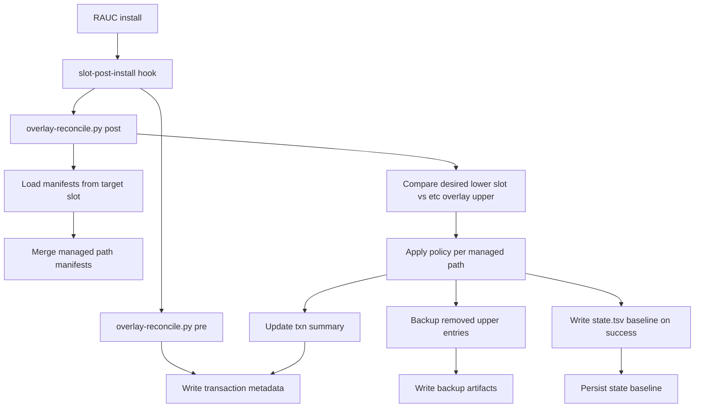

# OTA `/etc` Overlay Reconciliation Architecture

This document explains how the gateway keeps `/etc` configuration coherent after
RAUC A/B updates when runtime overlayfs state can drift from new slot content.

## Why This Exists

The system uses a read-only rootfs with persistent overlay upper for `/etc`:

- lower: new slot content after OTA
- upper: persisted runtime entries in `/data/overlays/etc/upper`

Without reconciliation, stale upper-layer files can mask updated lower-slot
files and cause post-update regressions (service users/groups, unit masks,
security metadata, default configs).

## Execution Model

Reconciliation runs only during RAUC bundle install hooks (not as a perpetual
boot-time daemon).

- hook scripts:
  - `meta-iot-gateway/recipes-ota/rauc/files/bundle-hooks.sh`
  - `meta-iot-gateway/recipes-ota/rauc/files/bundle-hooks-fit.sh`
- reconciliation tool:
  - `meta-iot-gateway/recipes-ota/rauc/files/overlay-reconcile.py`

Mermaid architecture:



Path notes:

- Transaction and state files: `/data/iotgw/overlay-reconcile/txn.json`, `/data/iotgw/overlay-reconcile/state.tsv`
- Backup directory: `/data/iotgw/overlay-reconcile/backups/`
- Overlay upper compared by reconciler: `/data/overlays/etc/upper`

## Policy Model

Manifest sources in target slot:

- `/usr/share/iotgw/overlay-reconcile/managed-paths.conf`
- `/usr/share/iotgw/overlay-reconcile/managed-paths.d/*.conf`

Supported policies:

- `enforce`: remove stale upper entry if it differs from desired lower file.
- `replace_if_unmodified`: update only when upper still matches previous known
  baseline hash (preserve local operator edits).
- `preserve`: keep upper entry unchanged.
- `absent`: desired state is no upper entry (remove stale masks/symlinks/files).
- `enforce_meta`: enforce uid/gid/mode on upper regular file while preserving content.

## Tradeoffs

- `enforce`
  - Pros: strongest convergence to image state.
  - Cons: local runtime edits under `/etc` do not persist across OTA for those paths.
- `replace_if_unmodified`
  - Pros: keeps operator-modified files intact.
  - Cons: if a file was locally touched, OTA fixes for that file may not apply automatically.
- `preserve`
  - Pros: full operator control for runtime toggles.
  - Cons: no automatic convergence; drift can accumulate.
- `absent`
  - Pros: explicitly removes known stale overlay artifacts (e.g., old unit masks/wants links).
  - Cons: requires accurate manifest ownership of intended absences.
- `enforce_meta`
  - Pros: fixes security-critical ownership/mode drift without clobbering file content.
  - Cons: applies only when an upper regular file exists; does not create content.

## Failure Semantics

- Non-optional managed file missing in target slot -> reconciliation fails.
- Optional managed file missing -> logged as info, install continues.
- `state.tsv` baseline is updated only on successful reconciliation.
  - This prevents corrupting future `replace_if_unmodified` decisions.

## Operations

Inspect latest reconcile artifacts:

```bash
ls -l /data/iotgw/overlay-reconcile/
cat /data/iotgw/overlay-reconcile/txn.json
cat /data/iotgw/overlay-reconcile/state.tsv
find /data/iotgw/overlay-reconcile/backups -maxdepth 4 -type f | tail -n 20
```

Inspect hook/reconcile logs during install:

```bash
journalctl -u rauc.service --no-pager | grep -E "bundle-hook|overlay-reconcile"
```

Interpret the outputs:

- `txn.json`
  - `status`: expected steady state is `applied` after a successful post-install phase.
  - `updated`: number of managed entries changed to match policy/desired state.
  - `preserved`: number of managed entries intentionally left unchanged by policy.
  - `skipped_optional_missing`: optional manifest entries absent in target slot (informational).
  - `slot_name` / `slot_mount_point` / `bundle_mount_point`: install context for traceability.
- `state.tsv`
  - Baseline hash map used by `replace_if_unmodified` to decide whether an upper file was locally modified.
  - Updated only on successful reconciliation to avoid poisoning future decisions.
- `backups/`
  - Timestamped copies of removed/replaced upper-layer entries.
  - Useful for post-update diffing, incident review, or manual recovery.
